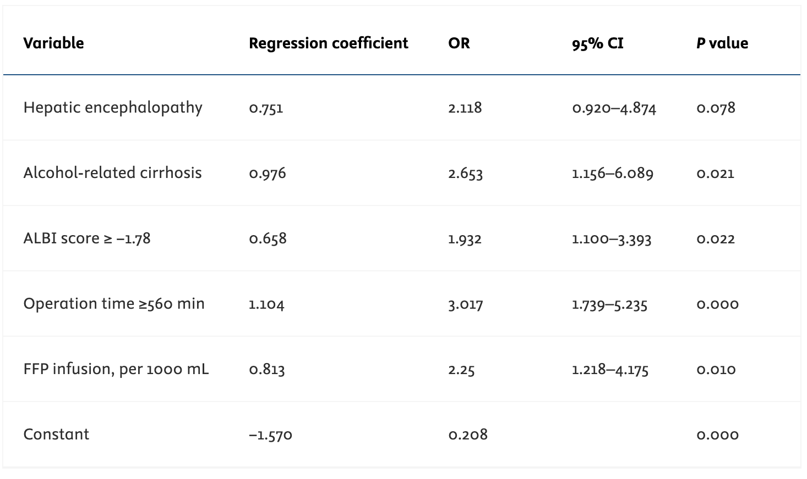
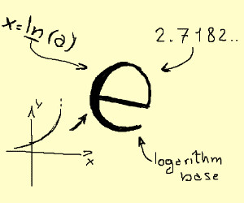
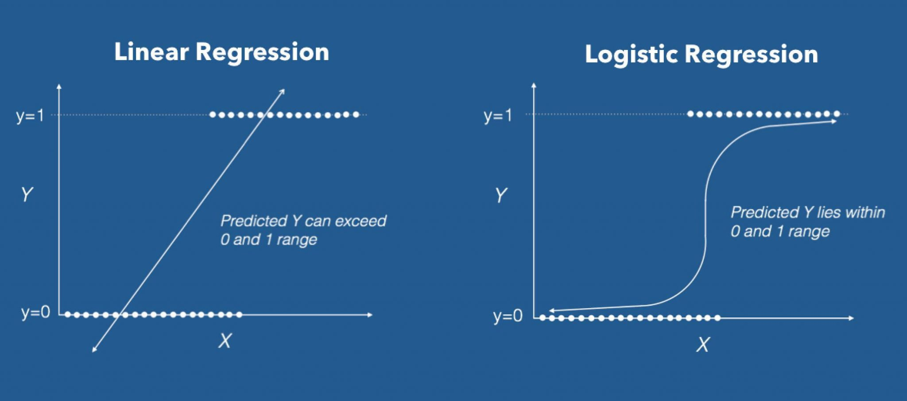
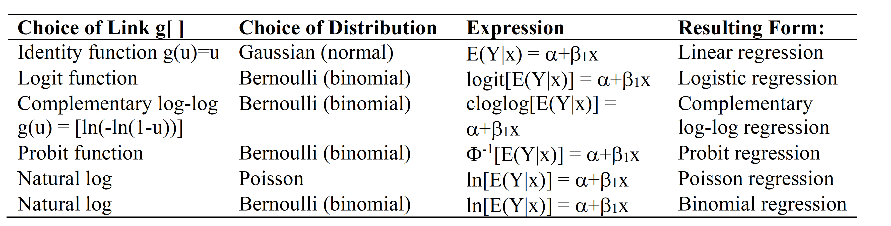
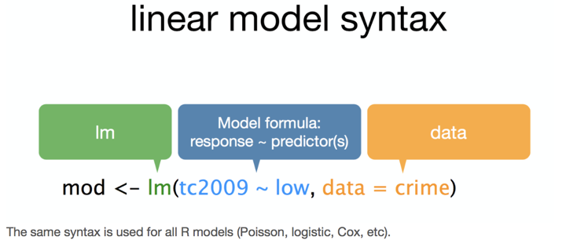
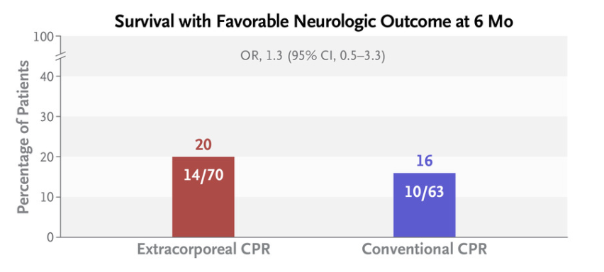

```{r setup, echo=FALSE, message = FALSE, warning = FALSE}
knitr::opts_chunk$set(
  echo = FALSE,
  eval = TRUE,
  fig.align = "center",
  fig.asp = 0.618,
  fig.retina = 3,
  fig.width = 6,
  message = FALSE,
  warning = FALSE,
  dev = "svg",
  out.width = "80%")

options(knitr.table.format = "html")
options(knitr.kable.NA = '   ')

library(here)
library(knitr)
library(survey)
library(tidyverse)
library(broom)
library(xaringanthemer)
library(ggdag)
library(tidyverse)
library(tidymodels)
library(openintro)
library(ggridges)
library(brms)
library(rstanarm)
library(ggdist)
set.seed(1234)
library(rmarkdown)
library(gtsummary)
library(kableExtra)
library(jtools)
library(ggplot2)
#library(cmdstanr)


```


```{r xaringan-themer, include = FALSE}
style_mono_accent( 
  base_color = "#004D40",
  background_color = "#FFFFFF",
  code_font_size = ".8rem",
  extra_css = list("li" = list("padding" = "8px 0px 0px")))

```


## .red[Have you met Euler?]

```{r echo=FALSE, fig.height=2, fig.width=3, message=FALSE, warning=FALSE}

```

---
class:middle
**Expected competencies**
- Knows when logistic regression analysis is needed (Questions and type of data).
- Can describe the logistic regression model, (assumptions & implications).
- Knows the relationship between ORs and Logistic regression coefficients.
- Knows how a statistical package is used to fit a logistic regression model to continuous and categorical predictors.
 - Interpret logistic regression model output, and assess model's fit.

--

### Objectives 
- To review core concepts of logistic regression 
- Provide tools to improve the inference when assessing binary outcomes.
- Revise considerations of prediction.
- Illustrate advantages of Bayesian inference.

---
class:middle

**[Early Prediction of Acute Kidney Injury Following Liver Transplantation: Development and Validation of a Clinical Risk Model](https://pubmed.ncbi.nlm.nih.gov/41048885/)**

Abstract:
>"_Methods_: _A total of 453 adult Liver Transplan (LT) recipients treated at the Beijing Tsinghua Changgung Hospital between January 2018 and October 2022 were enrolled. [...] Acute Kidney Injury (AKI) was diagnosed using the 2012 KDIGO criteria. **Univariate and multivariate logistic regression analyses** identified clinical factors associated with early AKI._"

> "_Univariate analysis was undertaken to identify variables significantly associated with AKI (P < 0.05). Variables with P < 0.1 were involved in the multivariate logistic regression analysis. Collinearity was assessed using the variance inflation factor (VIF), and variables with a VIF >5 were excluded. Stepwise backward logistic regression was employed to select predictors, optimizing the model by retaining the fewest predictors necessary to maintain performance. The final model was developed to predict the risk of AKI within 48 h following LT._"


.small[Wei, Yuzhi et al. [Early Prediction of Acute Kidney Injury Following Liver Transplantation: Development and Validation of a Clinical Risk Model.(https://www.jcehepatology.com/article/S0973-6883(25)00679-6/fulltext) Journal of Clinical and Experimental Hepatology, Volume 16, Issue 1, 103179.]

---
class:middle

**[Early Prediction of Acute Kidney Injury Following Liver Transplantation: Development and Validation of a Clinical Risk Model](https://pubmed.ncbi.nlm.nih.gov/41048885/)**

> **Results:** "_The predictive model was expressed as follows: **logit (P)** = −1.570 + (0.751 × preoperative HE) + (0.976 × preoperative alcohol-associated cirrhosis) + (0.658 × ALBI score ≥ −1.78) + (1.104 × operation time ≥560 min) + (0.813 × intraoperative FFP transfusion per 1000 mL)._"

> "_The model, incorporating these five predictors, demonstrated strong discrimination. In the development cohort, the **AUROC** was 0.760 (95% CI: 0.703–0.816, Figure 2A), and the **Hosmer–Lemeshow test** yielded a Chi-square value of 6.8 (degrees of freedom [d.f.] = 8, P = 0.555). [...] The diagnostic performance metrics of the model were as follows: **sensitivity** of 0.592, **specificity** of 0.867, negative predictive value of 0.746, and positive predictive value of 0.763. **Calibration curves** demonstrated near-linear agreement between predicted and actual risks, with slight underestimation at extreme probabilities (Figure 3B)._" 

.small[Wei, Yuzhi et al. [Early Prediction of Acute Kidney Injury Following Liver Transplantation: Development and Validation of a Clinical Risk Model.(https://www.jcehepatology.com/article/S0973-6883(25)00679-6/fulltext) Journal of Clinical and Experimental Hepatology, Volume 16, Issue 1, 103179.]

---
class:middle

**_Table 3: Final Prediction Model for Acute Kidney Injury Within the First 48 h Following Liver Transplantation, Developed Using Multivariable Logistic Regression_**

```{r echo=FALSE, fig.height=2, fig.width=3, message=FALSE, warning=FALSE}

```

.small[Wei, Yuzhi et al. [Early Prediction of Acute Kidney Injury Following Liver Transplantation: Development and Validation of a Clinical Risk Model.](https://pubmed.ncbi.nlm.nih.gov/41048885/) Journal of Clinical and Experimental Hepatology, Volume 16, Issue 1, 103179.]


---
class:middle
### .red[Have you met Euler?]
.pull-left[
```{r echo=FALSE, fig.height=2, fig.width=3, message=FALSE, warning=FALSE}

```
]
--
.pull-right[
```{r echo=FALSE, fig.height=2, fig.width=3, message=FALSE, warning=FALSE}

```
]

--
.red[Eulers' number a.k.a.' _e_ ' is a numerical constant `r exp(1)`...]

- Described under logarithm concepts & it's basically the base of the natural logarithm. 
- Mostly used to represent the non-linear increase or decrease of a function.
- In `R` we use the expression `exp()`
- $e^1$ = exp(1) =`r exp(1)`; $e^0$ = exp(0) = `r exp(0)` & $e^\infty$ = 0

---
class:middle
##Basic math - review of logarithms

**.red[Laws of Exponents: ]**


$$e{^\alpha} \cdot \,  e{^\beta} = e{^{\alpha + \beta}}$$
$$(e{^\alpha})^\beta = e{^{\alpha\beta}}$$
where $\alpha$ and $\beta$ can be any real numbers and be any positive real number

**.red[Logarithms:]**

$$e{^x} = N$$
The value of x which solves this equation is written as:
$$x = log{_e}N$$
The right-hand side is expressed as “log to the base $e$ of $N$”
---
class:middle
### Basic math

.red[Other manipulations]

$$log{_e}M + log{_e}N = log{_e}(MN)$$
$$log{_e}M - log{_e}N = log{_e}(M/N)$$
$$log{_e}(M^{N}) = N \cdot log{_e}(M)$$

The purpose of these early logarithmic tables was to take advantage of the law of exponents in order to avoid messy multiplications in the era before electronic calculators.  

--

- Any positive base is possible for logarithms. For example, the exponential equation $4^3 = 64$ can be written in terms of a logarithm as $log_{4}(64) = 3$    
- In practice, the only bases that actually get used to any extent are 10 (“common logarithms”, written  as `log10(x)` ) and e = 2.71828 ("natural logarithm", `log(x)`) <span style="color:red"> $\leftarrow$ Euler's </span>

$$e=\sum \limits _{n=0}^{\infty }{\frac {1}{n!}}=1+{\frac {1}{1}}+{\frac {1}{1\cdot 2}}+{\frac {1}{1\cdot 2\cdot 3}}+\cdots$$

---
class: middle

## Predicting categorical outcome data
```{r}

```


---

### Spam filters

.pull-left[
- Data from 3921 emails and 21 variables on them contained in `openintro` package
- **Outcome:** whether the email is spam or not
- **Predictors:** number of characters, whether the email had "Re:" in the subject, time at which email was sent, number of times the word "inherit" shows up in the email, etc.
 Can use `glimpse(email)` or `srt(email) to see the dataset
]
.pull-right[
.small[
```{r}
library(openintro)
# glimpse(email) # to see the dataset
email %>% select(spam, num_char, re_subj, to_multiple, urgent_subj, winner, attach, inherit,) %>% tbl_summary()

```
]
]

---
class:middle
## Spam filters
.question[
Would you expect longer or shorter emails to be spam?
]

--

.pull-left[
```{r echo=TRUE, out.width="90%"}
plotspam<- email %>%
  ggplot(aes(x = num_char, y = spam,  fill = spam, color = spam)) +
  geom_density_ridges2(alpha = 0.5) +
  labs(x = "Number of characters (in thousands)",
    y = "Spam", title = "Spam vs. number of characters") +
  guides(color = FALSE, fill = FALSE) +
  scale_fill_manual(values = c("#89CFF0", "#f1948a")) +
  scale_color_manual(values = c("#0096FF", "#b03a2e")) +theme_minimal()
plotspam
```
]
--
.pull-right[
```{r echo=TRUE}

t<-email %>% group_by(spam) %>% 
  summarise(mean_num_char = mean(num_char))
kable(t)

```

--
```{r echo=FALSE, message=FALSE, warning=FALSE, out.width="60%"}
# Would you expect emails starting with "Re:", "RE:", "re:", or "rE:" to be spam or not?
email %>% ggplot(aes(x = re_subj, fill = spam)) +
  geom_bar(position = "fill") +
  labs(x = 'Whether “re:”, "RE:", etc. was in the email subject.', fill = "Spam", y = NULL,title = 'Spam vs. "re:" in subject') +
  scale_fill_manual(values = c("#DEB4A0", "#CA235F"))+ theme_minimal()
```
]

---
class:middle
## Modelling spam

- Both number of characters and whether the message has "re:" in the subject might be related to whether the email is spam. 

**.red[How do we come up with a model that will let us explore this relationship?]**


- For simplicity, we'll focus on the number of characters (`num_char`) as predictor, but the model we describe can be expanded to take multiple predictors as well.

---
class:middle
## Modelling spam

Let's first look at the data     
.pull-left[
```{r echo=TRUE, message=FALSE, warning=FALSE, out.width="70%"}
means <- email %>%
  group_by(spam) %>%
  summarise(mean_num_char = mean(num_char)) %>%
  mutate(group = 1)

g <- ggplot(email, aes(x = num_char, 
     y = spam, color = spam)) +
  geom_jitter(alpha = 0.2) +
  geom_line(data = means, 
  aes(x = mean_num_char, y = spam, group = group), 
  color = "green", size = 1.5) +
  labs(x = "Number of characters (in thousands)", y = "Spam") +
  scale_color_manual(values = c("#0096FF", "#b03a2e")) +
  #guides(color = FALSE)+ 
  theme_bw()
```
]
.pull-right[
```{r, echo=FALSE, message=FALSE, warning=FALSE, out.width="100%"}
g
```
This isn't something we can reasonably fit a linear model to, .red[we need something different!]
]
---
class:middle
### Framing the problem
- We can treat each outcome (spam and not) as successes and failures arising from separate _Bernoulli_ trials
  - **Bernoulli trial**: a random experiment with exactly two possible outcomes, "success" and "failure", in which Pr(success) is the same every time the experiment is conducted
  
--
- Each Bernoulli trial can have a separate probability of success

$$ y_i ∼ Bern(p_i) $$

- We can then use the predictor variables to model that probability of success, $p_i$
- We can't just use a linear model for $p_i$ (since $p_i$ must be between 0 and 1) but we can transform the linear model to have the appropriate range

---
class: middle

## Example:

How many heads from 20 flips of a fair coin ** rbinom(20,1,.5)** for reproducibility need `set.seed (704)`
```{r echo=TRUE}
set.seed(704)
sample1 <- rbinom(20,1,.5) #<< 20 = n0 tries, 1 = sample size (Bernoulli), 0.5 probability event
sample1
```

---
class: middle

### Sequential learning
Here is the sequence of data outcomes (0/1) of 20 trials with p = 0.5
```{r out.width="70%"}
#function for plotting
library(ggridges)
prop_model <- function (data = c(), prior_prop = c(1, 1), n_draws = 10000, 
    show_plot = TRUE) {
    data <- as.logical(data)
    proportion_success <- c(0, seq(0, 1, length.out = 100), 1)
    data_indices <- round(seq(0, length(data), length.out = min(length(data) + 
        1, 20)))
    post_curves <- map_dfr(data_indices, function(i) {
        value <- ifelse(i == 0, "Prior", ifelse(data[i], "Success", 
            "Failure"))
        label <- paste0("n=", i)
        probability <- dbeta(proportion_success, prior_prop[1] + 
            sum(data[seq_len(i)]), prior_prop[2] + sum(!data[seq_len(i)]))
        probability <- probability/max(probability)
        data_frame(value, label, proportion_success, probability)
    })
    post_curves$label <- fct_rev(factor(post_curves$label, levels = paste0("n=", 
        data_indices)))
    post_curves$value <- factor(post_curves$value, levels = c("Prior", 
        "Success", "Failure"))
    p <- ggplot(post_curves, aes(x = proportion_success, y = label, 
        height = probability, fill = value)) + geom_density_ridges(stat = "identity", 
        color = "white", alpha = 0.8, panel_scaling = TRUE, size = 1) + 
        scale_y_discrete("", expand = c(0.01, 0)) + scale_x_continuous("Underlying proportion of success") + 
        scale_fill_manual(values = hcl(200 * 2:0 + 15, 150, 65), 
            name = "", drop = FALSE, labels = c("Prior   ", "Success   ", 
                "Failure   ")) + theme_light(base_size = 16) + 
        theme(legend.position = "right")
    if (show_plot) {
        print(p)
    }
    invisible(rbeta(n_draws, prior_prop[1] + sum(data), prior_prop[2] + 
        sum(!data)))
}
#sample1
```

--
Graphically our sequential learning process
```{r}
prop_model(sample1)
```

---
## Generalized linear models

- This is a very general way of addressing many problems in regression and the resulting models are called **generalized linear models (GLMs)**
- Logistic regression is just one example     
- Other examples      

- What is the difference btw the last 2 equations?
- Last equation gives risk ratio for binary outcomes.    
- Can also use identity function E(Y=1|X) for risk differences
???
difference is in rthe error terms
---
class:middle
## Three characteristics of GLMs

All GLMs have the following three characteristics:

1. A probability distribution describing a generative model for the outcome variable   
2. A linear model:      $$\eta = \beta_0 + \beta_1 X_1 + \cdots + \beta_k X_k$$    
3. A link function that relates the linear model to the parameter of the outcome distribution
  
---
class:middle
##R linear syntax
```{r out.width="40%", echo=FALSE}

```
Default link for linear regression is the identity function (Gaussian distribution)        
Logistic model link most often is logit function and binomial distribution

.large[.blue[
- Standard logistic model -> glm(model formula, data, family = "binomial")       
- Bayesian logistic model -> rstanarm::stan_glm(model formula, data, family=binomial(link="logit"))     
- Bayesian logistic model -> brms::brm(model formula, data, family=binomial(link="logit"))]]

---
class: middle

## Logistic regression

- Logistic regression is a GLM used to model a binary categorical outcome using numerical and categorical predictors
- To finish specifying the Logistic model we just need to define a reasonable link function that connects $\eta_i$ (linear outcome variable) to $p_i$ -> logit function
- **Logit function:** For $0\le p \le 1$
$$logit(p) = \log(\frac{p}{1-p}) = log (Odds)$$

--

.pull-left[
```{r echo=TRUE}
d <- tibble(p = seq(0.001, 0.999, 
        length.out = 1000)) %>%
  mutate(logit_p = log(p/(1-p)))
g <- ggplot(d, aes(x = p, y = logit_p)) + 
  geom_line() +  xlim(0,1) + 
  ylab("logit(p)") +
  labs(title = "logit(p) vs. p")
```
]
.pull-right[
```{r}
g
```

]
---
class: middle
### Properties of the logit and logistic (inverse logit) functions
Logit function takes a value between 0 and 1 and maps it to a value between $-\infty$ and $\infty$

$logit(p) = \log\left(\frac{p}{1-p}\right)= \alpha + \beta_1x$
- Take the inverse of the above equation, applies (*exp*) to both sides to get the **inverse logit** function,  AKA **logistic** or **expit** functions:
$$\frac{p}{1-p}= exp^{\alpha + \beta_1x}$$

--

- Rearranging leads to

$p = \frac{exp^{\alpha + \beta_1x}}{1+exp^{\alpha + \beta_1x}} \in (0,1) \,or\, equivalently\: p = \frac{1}{1+exp^{-(\alpha + \beta_1x)}} \in (0,1)$ 

- **.red[The above is the logistic function]** & takes a value between $-\infty$ & $\infty$ and maps it to a value between 0 & 1, a probability.    

---
class:middle
**Properties of the inverse logit or logistic function:**

.red[Logit is interpreted as the log odds of a success & inverse logit gives the probability of success.]

$$p = \frac{exp^{\alpha + \beta_1x}}{1+exp^{\alpha + \beta_1x}} \in (0,1)$$ 

If $p$ = P(D = 1 | X = x),  what is P(D = 0 | X = x)?      

$$P(D = 0 | X = x) = \frac{1}{1+exp^{\alpha + \beta_1x}} \in (0,1)$$ 
Facilitates the development of the logit model

$$Odds = \frac{P(D = 1 | X = x)}{P(D = 0 | X = x)} = \frac{\frac{exp^{\alpha + \beta_1x}}{1+exp^{\alpha + \beta_1x}}}{\frac{1}{1+exp^{\alpha + \beta_1x}}} = exp^{\alpha + \beta_1x}$$ 
Taking logs of both sides     
$$log(\frac{P(D = 1 | X = x)}{P(D = 0 | X = x)}) = log(Odds) = logit = \alpha + \beta_1x $$
---
class: middle
### The logistic regression model
Based on the three GLM criteria we have
  - $y_i \sim \text{Bern}(p_i)$
  - $\eta_i = \beta_0+\beta_1 x_{1,i} + \cdots + \beta_n x_{n,i}$
  - $\text{logit}(p_i) = \eta_i$
  - fit is done with maximum likelihood and not minimizing the sum of squared residuals, actually there are no residuals!

$$L(success) = \hat{\pi}$$
$$L(failure) = 1 - \hat{\pi}$$
$$L(model)   = \prod_{i=1}^{n} L(y_{i})$$   

--
- Likelihood values are often very small, one reason to use log-likelihood.    
- Log likelihood is always negative as the likelihood is always between 0-1.       
- Best fit is smallest value (i.e closest to 0)
---
class: middle
###Likelihood Ratio Test (LRT) 

Here, our goal is to compare the log-likelihoods of two models: the one we build vs. the constant model.     
<br>
Similar to comparing the sum of the squares explained by a LR model to the model that consists solely of the grand mean.    
<br>

The null hypothesis in the LRT is that $\beta_1 = \beta_2 = \cdots = \beta_k = 0$.        

The alternative hypothesis is that at least one of these coefficients is non-zero. The test statistic is:
$$G = -2\log(\text{constant model}) - (-2 \log(\text{model}))$$
These two quantities are known as deviances. It can be shown that $G$ follows a $\chi^2$ distribution with k degrees of freedom (k=no. of parameters in the model).

---
class:middle
### Likelihood Ratio Test (LRT) 

Spam example - model GLM (same format as LR except)      
- use `"glm"` instead of `"lm"` 
- define `family = "binomial"` for the link function 

```{r echo=TRUE, message=FALSE, warning=FALSE}
mod <- glm(spam ~ num_char, data = email, family = "binomial")
jtools::summ(mod, confint=T, exp=T, digits = 3, model.info = F, model.fit = F)
logLik(mod)
```

---
class:middle
### Likelihood Ratio Test (LRT) 

```{r echo=TRUE, message=FALSE, warning=FALSE}
library(lmtest)
lrtest(mod)
```
Model is improved with the addition of the `num_char` variable

---
class:middle
### The logistic regression model

3 spaces to consider

- logistic space - for 1 unit change in x -> linear change in $\beta_1$ (change in log odds)

- odds space - for 1 unit change in x  -> $\dfrac{e^{\beta_1(x+1)}}{e^{\beta_1x}}$ = $e^{\beta_1}$ **multiplier** -> (change in odds ratio)

- probability space - for 1 unit change in x -> no nice sentence to describe the change since non-linear function but intuitively easier to understand


$$p_i = \frac{\exp(\beta_0+\beta_1 x_{1,i} + \cdots + \beta_k x_{k,i})}{1+\exp(\beta_0+\beta_1 x_{1,i} + \cdots + \beta_k x_{k,i})} \in (0,1)$$
---

## Odds space
$e^{\beta_1}$ is the **multiplier** for for 1 unit change in x (odds ratio - constant change)     
Consider predicting spam based on inclusion of the term `winner`

```{r echo=TRUE}
two.way <- table(email$winner, email$spam); two.way <- two.way[c(2,1),] #changing row order to get OR associated with winner
kable(two.way); mosaic::oddsRatio(two.way) 
mod <- glm(spam ~ winner, data = email, family = "binomial"); exp(coef(mod))
```

This shows that OR calculated from 2X2 table = $exp (\beta)$ from logistic model

---

class:middle
## Spam model
```{r echo=TRUE}
#Usual model approach
spam_fit <- glm(spam ~ num_char, data = email, family = "binomial")
jtools::summ(spam_fit, digits=3, confint=T, model.info = F, model.fit = F) #use summary(spam_fit) for details

```


---

### Prediction
P(spam) for an email with 2000 characters      
Model:
$$\log\left(\frac{p}{1-p}\right) = -1.80-0.0621\times \text{num_char}$$

$\log\left(\frac{p}{1-p}\right) =$ -1.80-0.0621* 2 =  `r -1.80-0.0621* 2 `

$\frac{p}{1-p} = \exp(-1.9242) =$ `r round(exp(-1.9242),2)` $\rightarrow p = 0.15 \times (1 - p)$

$$p = 0.15 - 0.15p \rightarrow 1.15p = 0.15$$

$$p = 0.15 / 1.15 = 0.13$$
Somewhat easier with less calculations 
```{r echo=TRUE}
rstanarm::invlogit(-1.924)
```

---

class:middle
### Prediction
What is the probability that an email with 15000 or 40000 characters is spam? 
.pull-left[
```{r spam-predict-viz, echo=TRUE, out.width = "150%"}
# General formula from tidymodels

spam_fit <- logistic_reg() %>% set_engine("glm") %>% 
  fit(spam ~ num_char, 
      family="binomial", data = email)
newdata <- tibble(num_char = c(2, 15, 40), 
            color= c("#7CB9E8", "#E25822", "#1CAC78"), 
            shape  = c(22, 24, 23))

y_hat <- predict(spam_fit, newdata, type = "raw") 

p_hat <- exp(y_hat) / (1 + exp(y_hat))

newdata <- newdata %>% 
  bind_cols(y_hat = y_hat,p_hat = p_hat)

spam_aug <- augment(spam_fit$fit) %>% 
  mutate(prob =
          exp(.fitted) / (1 + exp(.fitted)))
```
]
--
.pull-right[
```{r echo=FALSE, message=FALSE, warning=FALSE, out.width='95%'}
g1 <- ggplot(spam_aug, aes(x = num_char)) +
  geom_point(aes(y = as.numeric(spam)-1, color = spam), alpha = 0.3) +
  scale_color_manual(values = c("#0096FF", "#b03a2e")) +
  scale_y_continuous(breaks = c(0, 1)) +
  guides(color = FALSE) +
  geom_line(aes(y = prob)) +
  geom_point(data = newdata, aes(x = num_char, y = p_hat), fill = newdata$color, shape = newdata$shape, stroke = 1, size = 6) +
  labs(x = "Number of characters (in thousands)",y = "Spam", title = "Spam vs. number of characters"
  ) + theme_classic()
g1
```

- .blue[`r paste0(newdata$num_char[1], "K chars: P(spam) = ", round(newdata$p_hat[1], 2))`]
- .brown[`r paste0(newdata$num_char[2], "K chars, P(spam) = ", round(newdata$p_hat[2], 2))`]
- .green[`r paste0(newdata$num_char[3], "K chars, P(spam) = ", round(newdata$p_hat[3], 2))`]
]


---
class:middle
## Prediction

- The mechanics of prediction is **easy**:
  - Plug in values of predictors to the model equation
  - Calculate the predicted value of the response variable, $\hat{y}$

--

- **.red[Getting it right is hard!]**
  - There is no guarantee the model estimates you have are correct
  - Or that your model will perform as well with new data as it did with your sample data

---
class:middle
## Underfitting and overfitting

```{r echo=FALSE, out.width="70%", warning = FALSE}
lm_fit <- linear_reg() %>%
  set_engine("lm") %>%
  fit(y4 ~ x2, data = association)

loess_fit <- loess(y4 ~ x2, data = association)

loess_overfit <- loess(y4 ~ x2, span = 0.05, data = association)

association %>%
  dplyr::select(x2, y4) %>%
  mutate(
    Underfit = augment(lm_fit$fit) %>% dplyr::select(.fitted) %>% pull(),
    OK       = augment(loess_fit) %>% dplyr::select(.fitted) %>% pull(),
    Overfit  = augment(loess_overfit) %>% dplyr::select(.fitted) %>% pull()
  ) %>%
  pivot_longer(
    cols      = Underfit:Overfit,
    names_to  = "fit",
    values_to = "y_hat"
  ) %>%
  mutate(fit = fct_relevel(fit, "Underfit", "OK", "Overfit")) %>%
  ggplot(aes(x = x2)) +
  geom_point(aes(y = y4), color = "darkgray") +
  geom_line(aes(y = y_hat, group = fit, color = fit), size = 1) +
  labs(x = NULL, y = NULL, color = NULL) +
  scale_color_viridis_d(option = "plasma", end = 0.7)
```

---
class: middle
### Sensitivity and specificity
We already learned how to compare models using the deviance, but how do we know how well our model works? 

One techinque for assessing the goodness-of-fit in a logistic regression model is to examine the percentage of the time that our model was *right*.”


|                         | Email is spam                 | Email is not spam             |
|-------------------------|-------------------------------|-------------------------------|
| Email labelled spam     | True positive                 | False positive (Type 1 error) |
| Email labelled not spam | False negative (Type 2 error) | True negative                 |


- Sensitivity = P(Labelled spam | Email spam) = TP / (TP + FN)
  - Sensitivity = 1 − False negative rate = 1 - (FN / (TP + FN) )
  
- Specificity = P(Labelled not spam | Email not spam) = TN / (FP + TN) 
  - Specificity = 1 − False positive rate = 1 - (FP / (FP + TN))

---
class: middle
### Classification

```{r echo=TRUE}
mod1 <- glm(spam ~ ., data = email, family = "binomial") #full model
email <- email %>%
  mutate(fitted = fitted.values(mod1)) %>%
  mutate(fitspam = ifelse(fitted >= 0.5, 1, 0))
tbl <- table(email$spam, email$fitspam)
tbl

sum(diag(tbl)) / nrow(email)


```

Model is correct 91.5% of the time

---
class: middle
### Accuracy of other models

.pull-left[
**Average** spam risk of the null model
```{r echo=TRUE}
av_risk <- sum(as.numeric(email$spam==1)) / nrow(email)
email <- email %>%
  mutate(fitspam= sample(c(0,1), size=3921, 
        replace=TRUE, c(1-av_risk, av_risk)))
table(email$spam, email$fitspam)
(table(email$spam, email$fitspam)[1,1] +
    table(email$spam, 
    email$fitspam)[2,2]) / nrow(email)

```
**model accuracy = 84.3%**
]

.pull-right[
Model probability as coin toss

```{r echo=TRUE}
email <- email %>% mutate(fitspam= sample(c(0,1), 
          size=3921, replace=TRUE))
table(email$spam, email$fitspam)
(table(email$spam, email$fitspam)[1,1] +
    table(email$spam, 
    email$fitspam)[2,2]) / nrow(email)
```

**model accuracy = 50%**
]
---
class: middle
### Trade-offs
.pull-left[
If you were designing a spam filter, would you want sensitivity and specificity to be high or low? 
<br>
```{r echo=TRUE}
library (rsample) # get initial_split, training and testing functions
email_split <- initial_split(email, prop = 0.80)
# Create data frames for the two sets:
train_data <- training(email_split) 
test_data  <- testing(email_split)
email_fit <- logistic_reg() %>% 
  set_engine("glm") %>% 
  fit(spam ~ ., data = train_data, 
      family = "binomial")
email_pred <- predict(email_fit, test_data, 
                      type = "prob") %>% 
  bind_cols(test_data %>% 
              dplyr::select(spam, time))
```
What are the trade-offs associated with each decision?
]

--
.pull-right[
```{r echo=TRUE, out.width="80%"}
email_pred %>% 
  roc_curve(truth = spam, .pred_1, event_level = "second") %>% autoplot()
email_pred %>% roc_auc(truth = spam,.pred_1, event_level = "second")
```
]
---
class:middle
### Types of logistic regression   

The three types of logistic regression      
1. Binary logistic regression - What we have been doing     
2. Multinomial logistic regression - When we have multiple outcomes, e.g. predict whether someone may have the flu, an allergy, a cold, or COVID-19    
3. Ordinal logistic regression - When the outcome is ordered, e.g. determine the severity of a COVID-19 infection, sorting it into mild, moderate, and severe cases        
<br>
**For what it's worth, in machine learning (ML) supervised learning is used to classify something or predict a value,  and logistic regression is a common classifier used ML **
---
class:middle

### Illustration of reproducing results and more...
A recent paper in the [NEJM](https://www.nejm.org/doi/full/10.1056/NEJMoa2204511) concluded that
  .red[ _"In patients with refractory out-of-hospital cardiac arrest, extracorporeal CPR and conventional CPR had similar effects on survival with a favorable neurologic outcome"_.]      
  
```{r echo=FALSE, message=FALSE, warning=FALSE, out.width="70%"}


```

**Two questions**      
1. Can we reproduce the analysis?
2. Accepting the authors' analysis, do we accept their conclusion of .red[similar effects]?

---
class:middle
### Illustration of reproduction of results
Given the use of OR, the analysis was most likely been a logistic regression with the binary outcome of success / failure at 180 days.    

```{r echo=TRUE}
# simulate dataset - one line per individual
dat <- data.frame(trt = 1:133 > 63,  #0 = control, 1 = extracorporeal
              #   time = sample(1:180, size = 133, replace = TRUE),  if wanted to simulate a  time to event
                 event = c(1:63 < 11, 1:70 < 15)) %>%
  mutate(trt = ifelse (trt=="FALSE", 0, 1),event = ifelse (event=="FALSE", 0, 1)) 
fit <- glm(event ~ trt, data = dat, family = binomial(link="logit"))
```
.pull-left[
**Log-Odds Coefficients**
```{r echo=FALSE, message=FALSE, warning=FALSE}
jtools::summ(fit, digits = 1, model.info = F, model.fit = F)
```
]
--
.pull-right[
**Exponentiated coefficients** which reproduces the NEJM results.
```{r echo=FALSE, message=FALSE, warning=FALSE}
jtools::summ(fit, confint=T, exp=T, digits = 2, model.info = F, model.fit = F)
```
]


---
class:middle
### Illustration of reproduction of results
A simpler approach is to use the aggregated data and apply a `weight` argument within the `glm` function which gives the exact same answer as expected.

```{r echo=TRUE}
# create data frame
dat1 <- tibble(Trial = c("INCEPTION", "INCEPTION"), Tx = c("cCPR", "eCPR"),
             fail = c(53, 56), success = c(10,14)) %>% 
  mutate(total = fail + success, prop_success = success / total) 
fit1 <- glm(prop_success ~ Tx, data = dat1, family = binomial(link="logit"), weights = total)
```

.pull-left[
**Log-Odds Coefficients**
```{r, echo=FALSE, message=FALSE, warning=FALSE}
jtools::summ(fit1, digits = 1, model.info = F, model.fit = F) #summary(fit1)
```
]
--
.pull-right[
**Exponentiated coefficients**
```{r echo=F, message=FALSE, warning=FALSE}
jtools::summ(fit1, confint=T, exp=T, digits = 1, model.info = F, model.fit = F)
```
]


---
class:middle
### Illustration: Reproduction of Results, using the Bayesian approach
Here are **4 methods** which all give the same answer as the frequentist method using the default vague priors (to see defaults  use `prior_summary`)       
- 2 approaches with `rstanarm` - one with aggregated data, one with individual data         
- 2 approaches with `brms` - one with aggregated data, one with individual data     

```{r, echo=TRUE, eval=FALSE}
#using stan_glm
fit2 <- stan_glm(prop_success ~ Tx, data = dat1, family = binomial(link="logit"), 
                 weights = total, refresh=0) #aggregate data
fit2a <- stan_glm(event ~ trt, data = dat, family = binomial(link="logit"), refresh=0)  #individual line data

#Using brms
fit3 <- brm(success | trials(total) ~ Tx, data = dat1, family = binomial(link="logit"), refresh=0) #aggregate data
fit3a <- brm(event ~ trt, data = dat, family = binomial(link="logit"), refresh=0) #individual line data
```


---
class:middle

**Using `stan_glm` with individual replication**
```{r}
fit2a <- stan_glm(event ~ trt, data = dat, 
        family = binomial(link="logit"), refresh=0)
print(fit2a, digits=2)

```

---
class:middle

**Using `brm`  replication**
```{r}
fit3 <- brm(success | trials(total) ~ Tx, data = dat1, family = binomial(link="logit"), refresh=0)
print(fit3, digits=2)
```


---
class:middle
### Reproduction of Results, using the Bayesian approach
How to assess the **.red[Odds Ratio]** from logistic regression model
.pull-left[
```{r echo=TRUE,message=FALSE, out.width= "130%", warning=FALSE, cache=TRUE}
library(knitr) 
  
fit3 <- brm(success | trials(total) ~ Tx,  
            data = dat1, 
            family = binomial(link="logit"), 
            refresh=0) #aggregate data
draws3 <- as_draws_df(fit3)  %>% # rename and drop the unneeded columns
  mutate(or = exp(b_TxeCPR)) # compute the OR

gg <- draws3 %>% 
  ggplot(aes(x = or)) +
  stat_halfeye(point_interval = mean_qi, 
               .width = .95, color="blue", 
               fill="lightblue") +# slab_colour
  scale_y_continuous(NULL, breaks = NULL) +
  xlim(0, 6) +
  xlab("Odds ratio")+ theme_bw()

```
]

--

.pull-right[
```{r, out.width="120%"}
gg
```
]


---
class:middle
### .red[Do we really want the OR?]
OR is a measure of association that is difficult to interpret     
- Popular because outcome from logistic regression models   

But other options exist for binomial data     

- The log-binomial and binomial regression models estimate the risk ratio and the risk difference, respectively     
- These models are sometimes referred to collectively as binomial regression models with, respectively, a log link and an identity link 

---
class:middle
### Reproduction of Results, using the Bayesian approach

.red[Risk difference] using binomial regression

```{r echo=TRUE, message=FALSE, warning=FALSE, cache=TRUE}

fit4 <- brm(success | trials(total) ~ Tx, data = dat1, 
            family = binomial(link="identity"), refresh=0) 
draws4 <- as_draws_df(fit4)  %>% #draws from posterior
   transmute(diff= 100*b_TxeCPR) # rename and drop the unneeded columns
```

--

```{r echo=TRUE, message=FALSE, warning=FALSE, cache=TRUE}
print(fit4, digits=2)
```


---

class:middle
### Reproduction of Results, using the Bayesian approach
.red[Risk difference] using binomial regression
```{r, out.width="55%"}
gg <- ggplot(draws4, aes(x = diff)) +
  stat_halfeye(aes(fill = after_stat(abs(x) < 2)),point_interval = mean_qi, .width = .95, color="red") +
  scale_y_continuous(NULL, breaks = NULL) +
  xlim(-20,25) +
  xlab("Risk difference survival benefit (eCPR - cCPR)") +
  scale_fill_manual(values = c("#f8c471", "royalblue")) +
  ggtitle("Risk difference of survival benefit (/100 patients)", subtitle = "Blue area = range of practical equivalence (ROPE) +/- 2%") +
  theme_bw() +
  theme(legend.position="none") 
gg
p_gt_2 <- sum(draws4$diff > 2) / nrow(draws4)
p_lt_2 <- sum(draws4$diff < -2) / nrow(draws4)
p_btw_2 <- sum(draws4$diff > -2 & draws4$diff < 2) / nrow(draws4)

```

Remember the authors' conclusions **"eCPR and cCPR had similar effects on survival"**     
What is the probability this is true?  Need to define .red[*similar*]?    

---
class: middle
### Region/Range of Practical Equivalence (ROPE)

```{r echo=FALSE, message=FALSE, warning=FALSE, out.width='35%'}
gg
```

--

**Assuming +/- 2 lives / 100 is similar**,        
- Blue area represents this equivalence probability, `r p_btw_2*100`%.     
- There remains a `r p_gt_2*100`% that eCPR offers a clinically meaningful survival benefit (orange area to the right of blue area).       

A good resource about the .red[Range of Practical Equivalence -ROPE [Here](https://easystats.github.io/bayestestR/articles/region_of_practical_equivalence.html)]  

.large[.red[Bayes has certainly deepened our appreciation of this data]]

---

class:middle
### Another advantage of using the Bayesian approach

Some prior information exists from 2 previous RCTs and the Bayesian analysis can take this information into account.     
- [PRAGUE](https://pubmed.ncbi.nlm.nih.gov/35191923/) & [ARREST](https://pubmed.ncbi.nlm.nih.gov/30092413/) trials  (combined) 25 successes and 122 failures in cCRP (beta(25, 122)).    
- PRAGUE & ARREST trials  (combined) 44 successes and 94 failures in eCRP (beta(44, 94)).  

--

```{r echo=TRUE, message=FALSE, warning=FALSE}
fit5 <- brm(success | trials(total) ~ 0 + Tx, data = dat1, 
            family = binomial(link="identity"), refresh = 0)

fit5 <- brm(success | trials(total) ~ 0 + Tx, data = dat1, 
            family = binomial(link="identity"),    
            prior = c(prior(beta(1, 1), class = b, lb = 0, ub = 1),
            prior(beta(25,122), class = b, coef = "TxcCPR"),
            prior(beta(44,94),class = b, coef = "TxeCPR")),
  chains = 4, warmup = 1000, iter = 2000, seed = 123, refresh = 0)

```

---
class:middle
### Another advantage of using the Bayesian approach
```{r}
print(fit5, digits=2)

draws5 <- as_draws_df(fit5)  %>% #draws from posterior
  # rename and drop the unneeded columns
  transmute(diff= 100*(b_TxeCPR - b_TxcCPR))
```


---
class:middle
### Another advantage of using the Bayesian approach
```{r echo=FALSE}
gg <- ggplot(draws5, aes(x = diff)) +
  stat_halfeye(aes(fill = after_stat(abs(x) < 2)),point_interval = mean_qi, .width = .95, color="red") +
  scale_y_continuous(NULL, breaks = NULL) +
  xlim(-5,25) +
  xlab("Risk difference survival benefit (eCPR - cCPR)") +
  scale_fill_manual(values = c("#ffc04c", "royalblue")) +
  ggtitle("Risk difference of survival benefit with informative prior", subtitle = "Blue area = range of practical equivalence (ROPE) +/- 2%") +
  theme_bw() +
  theme(legend.position="none") 
gg
```

Despite inconclusive result from INCEPTION trial, the totality of the evidence suggest a meaningful benefit from eCRP.

---

class: middle

###  QUESTIONS? 

## COMMENTS?

# RECOMMENDATIONS?

---
class: middle
```{r echo=FALSE, message=FALSE, warning=FALSE, out.width="70%"}

```


---
class: middle
## Code for the prediction plot
```{r echo=TRUE, eval=F, message=FALSE, warning=FALSE}
g1 <- ggplot(spam_aug, aes(x = num_char)) +
  geom_point(aes(y = as.numeric(spam)-1, color = spam), alpha = 0.3) +
  scale_color_manual(values = c("#0096FF", "#b03a2e")) +
  scale_y_continuous(breaks = c(0, 1)) +
  guides(color = FALSE) +
  geom_line(aes(y = prob)) +
  geom_point(data = newdata, aes(x = num_char, y = p_hat), 
             fill = newdata$color, shape = newdata$shape, 
             stroke = 1, size = 6) +
  labs(x = "Number of characters (in thousands)", y = "Spam", 
       title = "Spam vs. number of characters"
  ) + theme_classic()
#g1
```

---
class: middle
## Code for the Odds Ratio's Posterior Distributions
```{r echo=TRUE, eval=F, message=FALSE, warning=FALSE}

fit3 <- brm(success | trials(total) ~ Tx, 
      data = dat1, 
      family = binomial(link="logit"), refresh=0) #aggregate data
draws3 <- as_draws_df(fit3)  %>% # rename and drop the unneeded columns
  mutate(or = exp(b_TxeCPR)) # compute the OR

gg <- draws3 %>% 
  ggplot(aes(x = or, color ="lightblue")) +
  stat_halfeye(point_interval = mean_qi, 
               .width = .95, color="blue") +# slab_colour
  scale_y_continuous(NULL, breaks = NULL) +
  xlim(0, 9) +
  xlab("Odds ratio")+ theme_minimal()
```


---
class: middle
## Code for the ROPE
```{r echo=TRUE, eval=F, message=FALSE, warning=FALSE}
gg <- ggplot(draws4, aes(x = diff)) +
  stat_halfeye(aes(fill = after_stat(abs(x) < 2)), point_interval = mean_qi, .width = .95) +
  scale_y_continuous(NULL, breaks = NULL) +
  xlim(-20,25) +
  xlab("Risk difference survival benefit (eCPR - cCPR)") +
  scale_fill_manual(values = c("orange", "skyblue")) +
  ggtitle("Risk difference of survival benefit (/100 patients)", 
          subtitle = "Blue area = range of practical equivalence (ROPE) +/- 2%") +
  theme_bw() +
  theme(legend.position="none") 
```


Also check here: .blue[https://easystats.github.io/bayestestR/articles/region_of_practical_equivalence.html] 

Makowski, D., Ben-Shachar, M. S., & Lüdecke, D. (2019). bayestestR: Describing Effects and their Uncertainty, Existence and Significance within the Bayesian Framework. Journal of Open Source Software, 4(40), 1541. https://doi.org/10.21105/joss.01541
