```{r setup, echo=FALSE, message = FALSE, warning = FALSE}
knitr::opts_chunk$set(
  echo = FALSE,
  eval = TRUE,
  fig.align = "center",
  fig.asp = 0.618,
  fig.retina = 3,
  fig.width = 6,
  message = FALSE,
  warning = FALSE,
  dev = "svg",
  out.width = "80%")

options(knitr.table.format = "html")
options(knitr.kable.NA = '   ')

library(here)
library(knitr)
library(broom)
library(xaringanthemer)
library(rstanarm)
library(haven)
library(tidyverse)
library(memisc)
library(boot)
require(margins)
require(stdReg)
library(tibble)
library(jtools)
library(viridis)
library(hrbrthemes)
library(ggplot2)
library(dplyr)
library(ggridges)
library(logbin)
set.seed(7042025)
library(rosdata)
library(patchwork)
library(gtsummary)

```


```{r xaringan-themer, include = FALSE}
style_mono_accent( 
  base_color = "#F11111",
  background_color = "#FFFFFF",
  code_font_size = ".8rem",
  extra_css = list("li" = list("padding" = "8px 0px 0px")))

#darkcyan
```

class: middle
```{r echo=FALSE, message=FALSE, warning=FALSE, out.width="50%"}

```

---

class: middle

**Expected competencies:**
- Knows Basic mathematical concepts including logarithms, Laws of Exponents and Bernoulli and Binomial distributions.
- Knows relationship between Probabilities, Odds Ratios and RRs.
- Can fit a logistic regression and interpret the output model.

--

**Objective:** 
- To identify opportunities to estimate absolute and relative measures of association when the outcome is binary.
- Introduce the concept of marginal standardization


---

class: middle
### Outline
1) (mini) Review of concepts (Slides 4-18)
  - Outcome’s distribution and study designs
  - Regression adjustment (Why and When)
  
2) Alternatives to obtain absolute measures when the outcome is binary (Slides 19-85)
  - Prediction (at the modes, means)
  - Marginal standardization
  - Log binomial regression

**Extra slides:** For own review (86- 95)
---

## What do we know so far?

```{r echo=FALSE, message=FALSE, warning=FALSE, out.width="70%"}
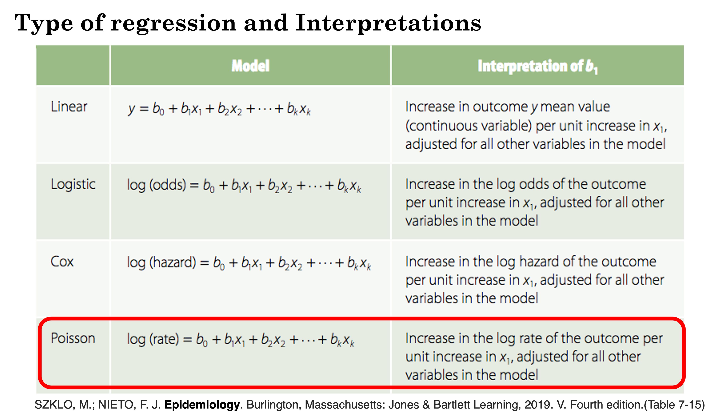
```

SZKLO, M.; NIETO, F. J.Epidemiology. Burlington, Massachusetts: Jones & Bartlett Learning, 2019. V. Fourth edition.(Table 7-15)

---
class: middle
### What do we know so far?

| Method   | Characteristics  |  Outcome    | Measure  |
|:---------|:----------------:|:------------|:--------:|
|Standardization| Weight-based adjustment; Depends on the standard pop. selected; No homogeneity needed | Binary or categorical | SMR|
|Mantel- Haenszel Adjustment| Requires homogeneity; Do not handle clusters | Binary or categorical |RD, RR, OR|
|Regression Adjustment| Efficient, Useful for prediction, adjust for several covariates, *require assumptions* | Any type |RD, RR, OR; AME/ATE | 
|IPTW  $^1$ | Regression + Weights: 1/Pr(X=1, covars);  Ensure Exchangeability; Only for measured Confounders | Any type | **Causal** RD, RR, OR; AME/ATE |

$^1$ More on this later, hopefully with the help of this lecture

.pull-right[**<span style="color:blue"> But wait… When and Why? </span>**]


---

class: middle
### Model <span style="color:red"> Assumptions </span> and Considerations

- What is the distribution of the data (for a fixed pattern of covariates)?

- Are the model-specific assumptions met?

- What function will be used to _link_ the mean of the data to the covariates?

- Which covariates should be included in the model?

---

class: middle
### Remember this table?

|Sample      | Risk Among Exposed | Risk Among Non- Exposed | Risk Difference | Risk Ratio    | Odds Ratio    |
|:-----------|:------------------:|:-----------------------:|:---------------:|:-------------:|:-------------:|
| 63 |  `r round(9/36, 2)` | `r round(6/27, 2)` | `r round((9/36) -(6/27), 2)` | `r round((9/36)/(6/27), 2)`| `r round((9/27)/(6/21),2)`|
| 63 |  `r round(6/36, 2)` | `r round(4/27, 2)` | `r round((6/36) -(4/27), 2)` | `r round((6/36)/(4/27), 2)`| `r round((6/30)/(4/23),2)`|
| 630|  `r round(6/360, 3)` | `r round(4/270, 3)` | `r round(0.017 - 0.015, 3)` | `r round((6/360)/(4/270), 2)`| `r round((6/300)/(4/230),2)`|
| 630|  `r round(90/360, 2)` | `r round(60/270, 2)` | `r round((90/360) -(60/270), 2)` | `r round((90/360)/(60/270), 2)`| `r round((90/270)/(60/210),2)`|


**<span style="color:blue"> But we want _meaningful_ and complementary measures (e.g., RD, RR)!! </span>**

---
class: middle
## “_But my outcome is <span style="color:blue">dichotomous!_</span>”

It doesn’t matter!!!
 
 "we are not chained to our output" let's not fell for the ["Risk relativism" By Poole](https://journals.lww.com/epidem/Fulltext/2010/01000/On_the_Origin_of_Risk_Relativism.2.aspx)

We also have <span style="color:blue">options</span> and a number of tools at our disposal to directly estimate risks, RRs and RDs 

---
class: middle
###Different Approaches
Parametric: Data/Outcome dependent (<span style="color:red"> Assumptions!</span>)

1) **.red[Frequentist approach]**
   - Deductive $\to P(Data|H_0)$
   - Uncertainty is given by the 95%Confidence Interval
   - Maximum likelihood Estimates
   - Consistent, efficient, asymptotically normal

2) **.blue[Bayesian approach]**
   - Inductive $P(\theta|Data)$
   - MCMC, priors!
   

Be aware of multiplicative models, sample size and number of parameters!

Data cleaning: variables’ coding and missing data


---
class: middle

**Simple models for generating absolute & relative estimates**


|Type        | Model               | Estimate  |
|:----------:|:-------------------:|:---------:|
|Continuous|Linear Regression | RD  |
|Binary |Logistic Regression, Binomial Regression|  OR,  **RR**, **RD** |
|Counts|Poisson, Negative Binomial $^1$ | IR, IRR, **RD**  |


**Assuming:** 
- Simple random sampling from a target population 
- Adequate sample size


$^1$ More on this on Poisson regression's lecture.

---
### Simulations for the impact of priors in data analysis

Consider several data scenarios, each time assuming that the true parameter values are a = −2 and b = 0.8 and that the values of $x$ are drawn from a uniform distribution between −1 and 1.    
- To repeat the same analyses (Bayesian & frequentist) with different sample sizes, we write a function.
- `bayes_sim()` enables the analysis to be sequentially performed as a both standard (maximum likelihood, `glm`) and Bayesian (`stan_glm`) logistic regression with varying sample sizes.       
--

```{r, echo=TRUE}
library("arm", "rstanarm")   
set.seed(7042025)
bayes_sim <- function(n, a = -2, b = 0.8) {
  data <- tibble(x = runif(n, min = -1, max = 1),
      y = if_else(0 < rlogis(n, location = a + b * x, scale = 1), 1, 0))
  fit_glm <- glm(y ~ x, family = binomial(link = "logit"), data = data)
  fit_stan <- stan_glm(y ~ x, family = binomial(link = "logit"),
      data = data, refresh = 0,
      prior = normal(location = 0.5, scale = 0.5)) #<<
  arm::display(fit_glm, digits = 1)
  cat("\n")
  print(fit_stan, digits = 1)
}
```
---

### Simulation study n = 10

Focus on inference about b, which was assigned a value = **0.8** when generating the data

```{r, echo=TRUE, message=FALSE, warning=FALSE}
set.seed(7042025); bayes_sim(n=10) #small sample size of only 10 obervations
```

---
class:middle
### Simulation study n = 10 interpretation

With only 10 observations, the maximum likelihood estimate is noisy, and in this simulation, `glm` gives a maximum likelihood estimate of **2.6**, with a large se = **2.0**, confirming that the likelihood provides little precision (information)      

--

As expected with little data the Bayesian posterior will be influenced the prior.
- Inference from `stan_glm` relies heavily on the prior distribution: the Bayes estimate of the coefficient = **0.7** is close to the prior mean of 0.5, being pulled away by the data only slightly.     
<br>

```{r }
set.seed(7042025); n=10
data <- tibble(x = runif(n, min = -1, max = 1),
      y = if_else(0 < rlogis(n, location = -2 + .8 * x, scale = 1), 1, 0))
fit_stan <- stan_glm(y ~ x, family = binomial(link = "logit"),
      data = data, refresh = 0,
      prior = normal(location = 0.5, scale = 0.5))
prior_summary(fit_stan)

```


---
### Simulation study n = 100

```{r, echo=TRUE}
set.seed(7042025); bayes_sim(n=100)
```

---
class:middle
### Simulation study n = 100 interpretation

With 100 observations, the maximum likelihood estimate has now excluded  more extreme values and provides a more precise estimate, and in this simulation, `glm` gives a MLE = 0.9, with a smaller $se$ = 0.6 (was 2.0), confirming that the likelihood (data) provides modest precision (information) and the CI includes the true parameter value (0.8)     

--

As expected with more data the Bayesian posterior will be less influenced the prior. 
- Nevertheless, the inference from `stan_glm`, parameter = 0.7 has still seen the data (0.9) pulled towards the prior (0.5) but less than with the previous smaller sample size   
<br>

---
### Simulation study n = 1000

```{r, echo=TRUE}
set.seed(7042025); bayes_sim(n=1000)
```

---
class:middle
### Simulation study n = 1000 interpretation

With 1000 observations, the maximum likelihood estimate now provides an accurate and precise estimate (0.9, se = 0.2) of the known parameter, $\beta_1 = 0.8$     
<br>
--
The Bayes estimate is now also dominated  by the data with an almost negligible effect of the prior.      
Once $n$ is as large as 1000, a weak or even a modest prior distribution doesn’t really make a difference and the two approaches produce essentially identical results.


---

### Building a Bayesian logistic regression model - A public health example

**Wells in Bangladesh**     
Example from [Regression and other Stories - Chapters 13-14](https://avehtari.github.io/ROS-Examples/)


```{r map, out.width="50%"}
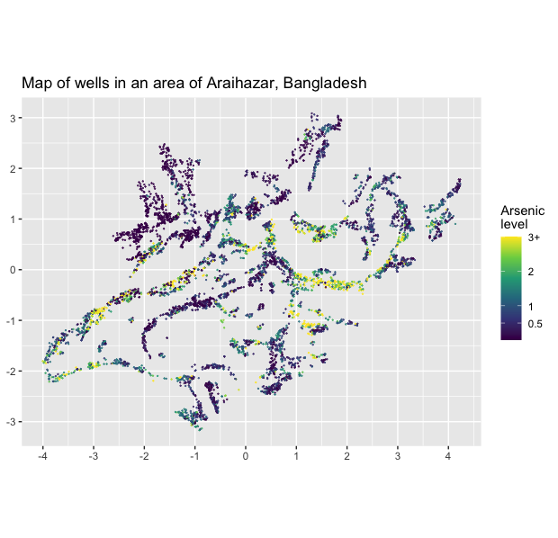
```
---
###Background: 

Research teams from the US and Bangladesh measured  all the wells and labeled them with their arsenic level as well as a characterization as “safe” (<0.5 micrograms per liter)     

People with unsafe wells were encouraged to switch to nearby private  or community wells or to new wells of their own construction.  A few years later, the researchers returned to find out who had switched wells. We shall perform  a logistic regression analysis to understand the factors **predictive **of well switching among the users  of unsafe wells.     
--

**.red[Variables:]** 
- **Outcome:** $y_i$ = 1 if household $i$ switched or = 0 if household $i$ continued using its own well.      
Potential independent (predictor) variables are    
  • distance (in meters) to the closest known safe well    
  • arsenic level of respondent’s well      
  • any household members  active in community organizations     
  • education level of the head of household     
  
We shall first fit the model just using distance to the nearest well and then put in arsenic  concentration, organizational membership, and education. [Regression and other Stories](https://avehtari.github.io/ROS-Examples/)
---
class:middle
### Read in the data
```{r, echo=TRUE}
# Data on arsenic in unsafe wells in Bangladesh
# remotes::install_github("avehtari/ROS-Examples",subdir = "rpackage")
library(rosdata)
data(wells)
file_common <- here::here("_common.R")  # Specific formating and functions
source(file_common) # Run common code
str(wells)

```
---
class:middle
###Data overview
.pull-left[
Table 1.
```{r, echo=TRUE}
#summary(wells) # details can found with ?wells
wells %>%  tbl_summary()
```
]
--

.pull-right[
How many homes with unsafe wells switched?

```{r, echo=TRUE}
wells %>% count(switch) %>% 
  mutate(prop = n / sum(n))
```
]


---

###  Visualization
.red[A helpful visualization]    
```{r, message=FALSE, out.width="50%"}
wells %>% 
  ggplot(aes(arsenic, switch)) + 
  stat_ydensity(
    aes(group = switch),
    width = 0.25,
    draw_quantiles = c(0.25, 0.5, 0.75),
    scale = "count"
  ) +
  geom_smooth() + # adds a blue trend line over an existing plot
  coord_cartesian(ylim = c(-0.125, 1.125)) +
  scale_y_continuous(
    breaks = seq(0, 1, 0.1),
    minor_breaks = NULL,
    labels = scales::label_percent(accuracy = 1)
  ) +
  scale_x_continuous(breaks = scales::breaks_width(1)) +
  labs(title = "Percentage of households who switched to new well by arsenic level",
    subtitle = "Voilin plots represent density of those do did and did not switch",
    x = "Arsenic level", y = "Percentage of households who switched") +
  theme(plot.title = element_text(size = 10, face = "bold"))
```
As expected, the % of households increases with the arsenic level in their well, from about 40% for wells that are just over the safety threshold to perhaps 80% for very high levels. The sparse data for high arsenic levels results in a large uncertainty.        
What is the .blue[blue] line?             
--
<br>
- The .blue[blue] line is a non-parametric approach to draw a smooth curve through a scatter plot, known as LOWESS (Locally Weighted Scatterplot Smoothing),or sometimes called LOESS (locally weighted smoothing)

---
###Logistic regression with just one predictor  
Fit the logistic regression 
```{r, echo=TRUE}

fit_0 <- stan_glm(switch ~ dist, family=binomial(link="logit"), refresh=0, data=wells, seed=123)
print(fit_0, digits = 4)
```
What happens to the $\beta$ coefficient if we change distance in meters to 100 meter units?
---
###Logistic regression with just one predictor  

Fit the logistic regression 
```{r, echo=TRUE}
wells$dist100 <- wells$dist/100  #change distance from meters to 100 meter units
fit_1 <- stan_glm(switch ~ dist100, family=binomial(link="logit"), refresh=0, data=wells, seed=123)
print(fit_1, digits = 4)
```

.red[If divide (or multiply) units by X then coefficient for X is multiplied (or divided) by X]
---

class:middle
### Interpreting coefficients - Three different scales 
We can interpret the coefficient estimates on 3 different scales    
$$log\, odds (switch) = logit\dfrac{p}{1-p} = 0.61 − 0.62 ∗ dist100$$
<br>
$$odds= exp^{logit} = exp^{0.61 − 0.62 ∗ dist100}$$
<br>
$$Pr\, (switch) = logit^{-1}(0.61 − 0.62 ∗ dist100) = \dfrac{1}{1 + exp^{-(0.61 − 0.62 ∗ dist100)}}$$  
---
class:middle
### Interpreting the logistic regression .red[intercept]    
$$log\, odds (switch) = logit\dfrac{p}{1-p} = 0.61 − 0.62 ∗ dist100$$     

**The constant term (intercept) is value when `dist100` = 0 **         
i) log odds (switching)  = 0.61      
<br>
ii) odds (switching) = $e^{0.61}$ = 1.84    
<br>
iii) P(switching) $p = \dfrac{odds}{odds + 1} = \dfrac{1.84}{2.84} = .65$, 

by rearranging $odds = \dfrac{p}{1-p}$              
<br>

--
More directly, constant term = probability(switching) when `dist100` = 0
$logit^{-1}(0.61) = \dfrac{1}{1+e^{-0.61}} = 0.65$ or with `R` code  `invlogit(0.61) = 0.65`       
Thus, model estimates a 65% probability of switching if live right  next to an existing safe well   

---
class:middle
### .red[Logistic Regression: Intercept]

```{r echo=FALSE, fig.height=2, fig.width=3, message=FALSE, warning=FALSE}
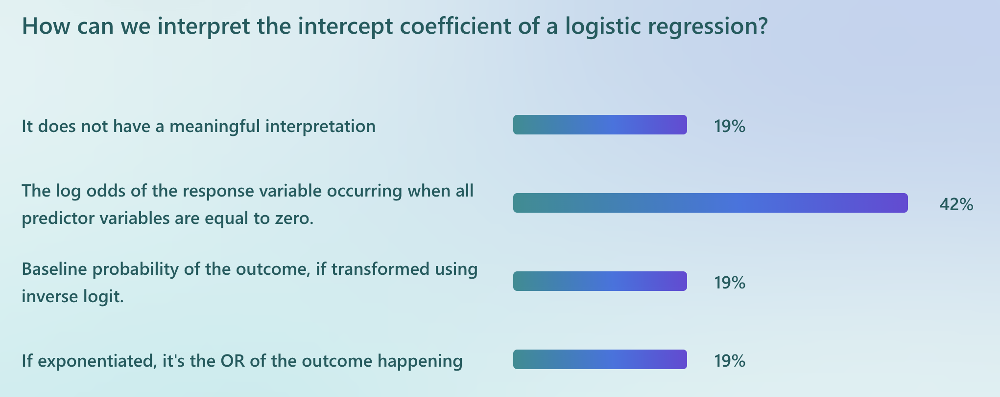
```

---
### Logistic regression with just one predictor  
```{r, echo=FALSE, out.width="80%"}
v <- tibble(arsenic = c(0.5, quantile(wells$arsenic, probs = c(0.25, 0.5, 0.75))),
    label = case_when(names(arsenic) == "" ~ as.character(arsenic),
        TRUE ~ str_glue("{format(arsenic, digits = 1, nsmall = 1)} ({names(arsenic)})") %>% 
          as.character()) %>% 
      fct_inorder(),
    dist = list(seq_range(wells$dist))
  ) %>% 
  unnest(dist) %>% 
  mutate(
    dist100 = dist / 100,
    .pred = 
      predict(fit_1, type = "response", newdata = tibble(arsenic, dist100))
  )

v %>% 
  ggplot(aes(dist)) +
  stat_ydensity(
    aes(y = switch, group = switch),
    data = wells,
    width = 0.25,
    draw_quantiles = c(0.25, 0.5, 0.75),
    scale = "count"
  ) +
  geom_line(aes(y = .pred)) +
  coord_cartesian(ylim = c(-0.125, 1.125)) +
  scale_y_continuous(breaks = seq(0, 1, 0.1), minor_breaks = NULL) +
  scale_x_continuous(breaks = scales::breaks_width(50)) +
  theme(legend.position = "bottom") +
  labs(
    title = 
      "Probability of household switching to new well by distance",
    subtitle =
      "Voilin plots represent density of those do did and did not switch",
    x = "Distance to the closest known safe well (meters)",
    y = "Probability of household switching",
    color = "Arsenic level (Quantile)"
  ) +
  theme(plot.title = element_text(size = 10, face = "bold"))
```
The probability of switching is about 65% `invlogit(.61)` for people who  live near a safe well, declining to about 20% for people who live more than 300 meters from any safe  well. This makes sense: the probability of switching is higher for people who live closer to a safe  well.
---
class:middle
### Interpreting the $\beta_1$ regression coefficient      

.large[.red[Remember this interpretation can also be made on 3 different scales]]          
$$log\, odds (switch) = logit\dfrac{p}{1-p} = 0.61 − 0.62 ∗ dist100$$  

i) Change in log odds for unit change in `dist100` = -0.62     
<br>
ii) $\Delta$ odds = `exp(-0.62)` = 0.54 (< likely to switch for each 100m increase in distance) 
.red[The ratio of the Odds, comparing each 100m increase vs 0mts]
<br>
iii) Since probability scale is nonlinear, $\dfrac{1}{1+e^{-0.61−0.62∗dist100}}$, must choose where to evaluate the effect of a 1 unit change in the `dist100` variable
---
class:middle
### Interpreting the $\beta_1$ regression coefficient      
<br>
- Often choose predictor mean (steepest part of logistic curve)       
`mean(wells$dist100)` = 0.48         
- Linear predictor for logit function = 0.61 − 0.62 ∗ 0.48 = 0.31         
- P(switching) = `invlogit(.31)` = 0.57 (reverts back to (0,1) probability scale)        
- Logit linear predictor for a 1 unit increment from the mean value = 0.61 − 0.62 ∗ 1.48 = -0.31     
- P(switching) = `invlogit(-0.31)` = 0.42    

Thus, adding 100 meters to the distance to the nearest safe well (from the mean distance), decreases the probability of switching by about 15% (57%-42%).    

---
class:middle
### Interpreting the logistic regression intercept    
$$log\, odds (switch) = logit\dfrac{p}{1-p} = 0.61 − 0.62 ∗ dist100$$     
```{r out.width="70%"}
library(patchwork)
inv_log_graph <- function(alpha=0, beta=1){
  d2 <- data.frame(x= seq(-8,8, length.out = 1000)) %>%
    mutate(logistic = exp(alpha+beta*x)/(1+exp(alpha+beta*x))) %>%
    ggplot( aes(x = x, y = logistic)) + 
    geom_line() + 
    ylab(expression(invlogit("x"))) +
    xlab("x") +
    labs(title = "inverse logit(B1*x) versus x")
  d2
}
# inv_log_graph() + labs(subtitle= "Intercept = 0, B1 = 1")

fig1 <- inv_log_graph(alpha=.61, beta=.62) + labs(title= "") +
   plot_annotation(title = 'invlogit (0.61 - 0.62*x) = invlogit(0) = 0.5, when x = - 0.61/0.62 = -0.98') +
  geom_point(aes(x=-.98, y=.5), size=4, color="red") +
  geom_segment(aes(x = -.98, y = 0, xend = -.98, yend = .5, colour = "red")) +
  geom_segment(aes(x = -8, y = .50, xend = -.98, yend = .5, colour = "red")) +
   theme(legend.position="none")
fig1
```


---
class:middle
###Interpreting the $\beta_1$ regression coefficient    
**Divide  by 4 rule**

The slope (1st derivative) of the inverse logistic function = $\frac{d(1/(1+exp(x)^{-1})}{dx}$
$$\dfrac{e^x}{{(e^{x}+1})^2}$$ 
(if you forgot how to take  derivatives use `D(expression(1/(1+exp(x)^-1)), "x")`   

--

The logistic curve is steepest at its center, which occurs when the linear predictors $\alpha + \beta x$ = 0 so that `invlogit(0)` = 0.5. 

Substituting x=0 into the 1st derivative equation maximizes the slope and equals $$\beta\dfrac{e^0}{{(e^{0}+1})^2} = \dfrac{\beta}{4}$$
Thus, $\dfrac{\beta}{4} = -0.62/4 = -0.15$ is the maximum $\Delta$ in Pr(y = 1)  corresponding to a unit difference in x.  

---

class: middle
### Graphing the fitted model with two predictors
**Probability switching to new well by distance and arsenic level**
```{r message=FALSE, warning=FALSE, include=FALSE}
# Data on arsenic in unsafe wells in Bangladesh
# remotes::install_github("avehtari/ROS-Examples",subdir = "rpackage")
library(rosdata)
data(wells)
file_common <- here::here("_common.R")  # Specific formating and functions
source(file_common) # Run common code
summary(wells)
```


.pull-left[
```{r, echo=FALSE}
fit_1 <- stan_glm(switch ~ assoc, family="gaussian", data=wells, refresh=0) 
fit_3 <- stan_glm(switch ~ dist100 + arsenic, family=binomial(link="logit"), data=wells, refresh=0) 

v <- 
  tibble(
    arsenic = c(0.5, quantile(wells$arsenic, probs = c(0.25, 0.5, 0.75))),
    label = 
      case_when(
        names(arsenic) == "" ~ as.character(arsenic),
        TRUE ~ 
          str_glue(
            "{format(arsenic, digits = 1, nsmall = 1)} ({names(arsenic)})"
          ) %>% 
          as.character()
      ) %>% 
      fct_inorder(),
    dist = list(seq_range(wells$dist))
  ) %>% 
  unnest(dist) %>% 
  mutate(
    dist100 = dist / 100,
    .pred = 
      predict(fit_3, type = "response", newdata = tibble(arsenic, dist100))
  )

v %>% 
  ggplot(aes(dist)) +
  stat_ydensity(
    aes(y = switch, group = switch),
    data = wells,
    width = 0.25,
    draw_quantiles = c(0.25, 0.5, 0.75),
    scale = "count"
  ) +
  geom_line(aes(y = .pred, color = label)) +
  coord_cartesian(ylim = c(-0.125, 1.125)) +
  scale_y_continuous(breaks = seq(0, 1, 0.1), minor_breaks = NULL) +
  scale_x_continuous(breaks = scales::breaks_width(50)) +
  theme(legend.position = "bottom") +
  labs(
    title = 
      "Probability of household switching to new well by distance \nand arsenic level",
    subtitle =
      "Voilin plots represent density of those do did and did not switch",
    x = "Distance to the closest known safe well (meters)",
    y = "Probability of household switching",
    color = "Arsenic level (Quantile)"
  )
```
]

--

.pull-right[
```{r, echo=FALSE}
v <- 
  tibble(
    dist = c(0, quantile(wells$dist, probs = c(0.25, 0.5, 0.75))),
    label = 
      case_when(
        names(dist) == "" ~ as.character(dist),
        TRUE ~ 
          str_glue(
            "{format(dist, digits = 1, nsmall = 1)} ({names(dist)})"
          ) %>% 
          as.character()
      ) %>% 
      fct_inorder(),
    arsenic = list(seq_range(wells$arsenic))
  ) %>% 
  unnest(arsenic) %>% 
  mutate(
    dist100 = dist / 100,
    .pred = 
      predict(fit_3, type = "response", newdata = tibble(arsenic, dist100))
  )

v %>% 
  ggplot(aes(arsenic)) +
  stat_ydensity(
    aes(y = switch, group = switch),
    data = wells,
    width = 0.25,
    draw_quantiles = c(0.25, 0.5, 0.75),
    scale = "count"
  ) +
  geom_line(aes(y = .pred, color = label)) +
  coord_cartesian(ylim = c(-0.125, 1.125)) +
  scale_y_continuous(breaks = seq(0, 1, 0.1), minor_breaks = NULL) +
  scale_x_continuous(breaks = scales::breaks_width(1)) +
  theme(legend.position = "bottom") +
  labs(
    title = 
      "Probability of household switching to new well by arsenic level \nand distance",
    subtitle =
      "Voilin plots represent density of those do did and did not switch",
    x = "Arsenic level",
    y = "Probability of household switching",
    color = "Distance in meters (Quantile)"
  )
```
]


---

## Recall: Linear Regression Model
Review: _“The effect of a given change in an independent variable is the same regardless the value of that variable at the start of it changes and regardless of the level of the other variables in the model.”_

  $y = α+ βx + 𝛅d$  

```{r echo=FALSE, message=FALSE, warning=FALSE, out.width="50%"}
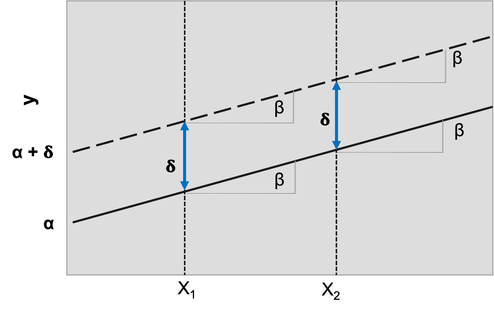
```

Adapted from: Long, J., & Freese, J. (2006).Regression models for categorical dependent variables using stata(Second ed.). College Station, Texas: StataCorp LP.


---
#### Linear Probability Model for RDs when the outcome is binary: 
.pull-left[
```{r message=FALSE, warning=FALSE}
mod1a <- lm(switch ~ dist100, data=wells)
summ(mod1a, confint = T)
```
]

--
.pull-right[
```{r message=FALSE, warning=FALSE}
mod1b <- lm(switch ~ assoc, data=wells)
summ(mod1b, confint = T)

```
]

**Remember the divide by 4 rule?**
$\dfrac{\beta}{4} = -0.62/4 = -0.15$ is the maximum difference in Pr(y = 1)  corresponding to a unit difference in x. **Would it work here too?**

---
class: middle

### (I) Linear Probability Model for RDs when the outcome is binary: 

.pull-left[
**<span style="color:blue"> Advantages:</span>**   	
- Very easy to fit
- Single uniform estimate
- _Economists will love you_
]
.pull-right[
**<span style="color:blue"> Disadvantages:</span>**  	
- Possible to get _impossible_ estimates
- Biostatisticians will hate you
]

Fit an OLS linear regression on the binary outcome variable:  $Pr(Y=1|X=x) = β0 + β1X$ 

**Note:**  Homoskedasticity assumption cannot be met, since variance is a function of $p$.  Therefore, use robust variance.  


---
class: middle
###Multiplicative Models 
Review: _“The effect of a change in a variable **depends** on the values of all variables in the model and it’s no longer simply equal to one of the parameters in the model”_

```{r echo=FALSE, message=FALSE, warning=FALSE, out.width="60%"}
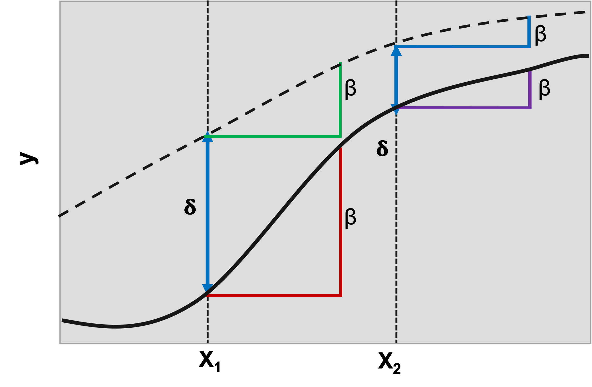
```

Adapted from: Long, J., & Freese, J. (2006).Regression models for categorical dependent variables using Stata (Second ed.). College Station, Texas: StataCorp LP.


---
class: middle
###Multiplicative Models - Review

- Binary outcomes
- Expressed on a transformed scale, it prescribes a linear relationship between the log-odds of Y and X.

$$P(X=1) = \frac{exp(\alpha + \beta_x)} {1 + exp(\alpha + \beta_x)}$$

- The log odds of the outcome is linearly related to $x$, with intercept coefficient $\alpha$ and slope coefficient $\beta$
 - i.e., the logistic model is an **additive model** when expressed on the log odds scale.

---
class: middle
## Logistic Regression: Log Odds vs Probabilities

```{r echo=FALSE, message=FALSE, warning=FALSE, out.width="70%"}
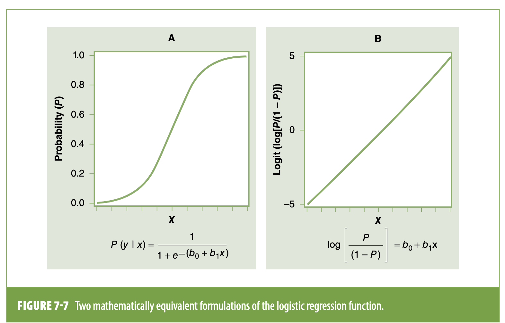
```

---
class:middle
### .red[Logistic Regression: Odds Ratio]

```{r echo=FALSE, fig.height=2, fig.width=3, message=FALSE, warning=FALSE}
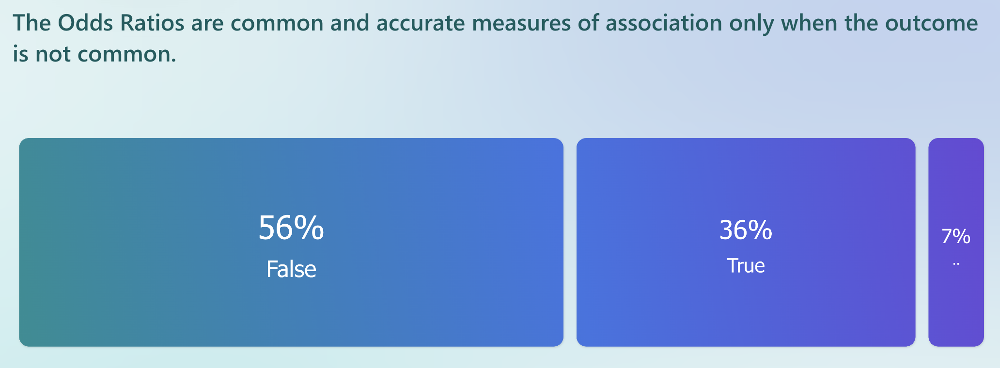
```

---
class: middle
### (II) Logistic Models for RDs and RRs

.pull-left[
**<span style="color:blue"> Disadvantages: </span> **	
 - Does not give a **single** uniform estimate 
 - Choose between different formulations		
]
.pull-right[
**<span style="color:blue"> Advantages:  </span>**  	
 - Always fits easily
 - Can never get impossible estimates
 - Epidemiologists will love you
]

		

---

class: middle
### Logistic Models for RDs and RRs
Several approaches:
- Transformation of ORs, estimation of RRs/RDs with different models

**Simple as:**

**(1)** Fit a logistic regression

**(2)** Predict probabilities based on the regression parameters (several options to do this!)

**(3)** Use these probabilities to calculate risk ratios/risk differences

---
class: middle
### (1) Fit a standard logistic regression model:

.pull-left-narrow[
**The Frequentist way**
```{r echo=TRUE,message=FALSE, warning=FALSE}
mod2a <- glm(switch ~ assoc, data=wells, family = "binomial")
round(summ(mod2a, confint = T)$"coeftable", 2) #;summ(mod2a)
```
]
.pull-right-narrow[
**The Bayesian way:**
```{r echo=TRUE, message=FALSE, warning=FALSE}
mod2b <- stan_glm(switch ~ assoc, family=binomial(link="logit"), data=wells, refresh=0) 
round(mod2b$stan_summary[1:2,1:5-10], 2) #; print(mod2b, digits = 2) #; summary(mod2b)
```
]

.pull-right[Next: obtain the predicted probabilities]

---
class: middle
###(2) Estimate the probabilities based on/using the regression parameters and the observed data (i)

```{r echo=TRUE, message=FALSE, warning=FALSE}

p1<- predict(mod2a, newdata = transform(wells, assoc=1), type="response")
summary(p1) # probabilities among "Exposed"

p0<- predict(mod2a, newdata = transform(wells, assoc=0), type="response")
summary(p0) # probabilities among "Unexposed"


```

.pull-right[Next: contrast the predicted probabilities]

---
class: middle
###(3) Use these probabilities to calculate average "predictive" risk ratios/risk and differences

```{r echo=TRUE, message=FALSE, warning=FALSE}
RR<- p1/p0 # Calculate the ratio contrast
#summary(RR)
round(mean(RR), 2)
RD<- p1-p0 # Calculate the difference contrast
#summary(RD) 
round(mean(RD),2)

```


.pull-right[ <span style="color:blue"> Then we just obtained our RDs and RRs...</span> ]


---
class: middle
#### (2) Estimate the probabilities based on/using the regression parameters and the observed data (ii)

**_Inverse logit_ option:** 

The syntax is simple, using the "linear combination" for each group "Exposed" and "Unexposed" the functions are `inv.logit`, `invlogit` or any other `function` that estimates the inverse logit 
$$logit^{-1}(x) = \dfrac{1}{1+e^{x}}$$

**RR** <- inv.logit(Linear Combination for Exposed) **<span style="color:red"> $/$ </span>** inv.logit(Linear Combination Unexposed)

**RD** <- inv.logit(Linear Combination for Exposed) **<span style="color:red"> $-$ </span>** inv.logit(Linear Combination Unexposed)


---

class: middle
Using the `inv.logit` function: **The Frequentist way**

**<span style="color:blue"> Risk Ratio </span>**
```{r echo=TRUE, message=FALSE, warning=FALSE}
#Using the inv.logit
rr.i<-inv.logit(mod2a$coefficients["(Intercept)"] + mod2a$coefficients["assoc"]) / 
  inv.logit(mod2a$coefficients["(Intercept)"] )
round(rr.i, 2)
```

**<span style="color:blue"> Risk Difference </span>**
```{r echo=TRUE, message=FALSE, warning=FALSE}
rd.i<-inv.logit(mod2a$coefficients["(Intercept)"] + mod2a$coefficients["assoc"]) - 
  inv.logit(mod2a$coefficients["(Intercept)"] )
round(rd.i, 2)
```

.pull-right[Contrasting the predicted probabilities in a single step]

---

class: middle
Using the `invlogit` function: **The Bayesian way**

```{r, echo=TRUE, message=FALSE, warning=FALSE}
beta <- coef(mod2b) # to extract the beta coefficients from the model
beta
yes <- 1 #to assign exposed, assoc= 1
no <- 0 #to assign unexposed, assoc= 0

```

.pull-left[
<span style="color:blue"> Risk Ratio </span>
```{r, echo=TRUE, message=FALSE, warning=FALSE}
ratio<- invlogit (beta[1] + beta[2]*yes) /
         invlogit (beta[1] + beta[2]*no)
round(mean(ratio), 2)
```
]

.pull-right[
<span style="color:blue"> Risk Difference </span>
```{r , echo=TRUE, message=FALSE, warning=FALSE}
diff <- invlogit (beta[1] + beta[2]*yes) -
         invlogit (beta[1] + beta[2]*no)
round(mean(diff), 2)
```
]
Contrasting the predicted probabilities in a single step! 

---
class: middle

# How do I interpret these??

--

Average **<span style="color:purple"> predictive </span>**  ratios and differences effects


<br>
  Average **<span style="color:blue"> conditional </span>**  ratios and differences effects
  

---
class: middle
### Average Marginal Effects
Where/how you fix your covariates has an impact on your estimated probabilities (and your population of inference). [Muller and MacLehose](https://doi.org/10.1093/ije/dyu029) present us three strategies:

- <span style="color:blue"> Prediction at the modes </span>: conditional predicted probabilities are calculated for each exposure level with every covariate/confounder fixed at its most common value

- <span style="color:blue"> Prediction at the means </span>: conditional predicted probabilities are calculated for each exposure level with every covariate/confounder fixed at its mean value

- <span style="color:blue"> Marginal standardization </span>: predicted probabilities of the outcome are calculated for every observed confounder value and then <span style="color:purple"> combined as a weighted average separately for each exposure level</span>

[Estimating predicted probabilities from logistic regression: different methods correspond to different target populations, by Clemma J Muller & Richard F MacLehose](https://doi.org/10.1093/ije/dyu029)

---
class: middle
###Margins at the Modes
Assumes everyone had most common values of the confounders:

$Pr(Y=1|Set[E=e], Z=zm)$

- In the case of a single dichotomous confounder, we’d calculate predicted probabilities of the outcome only for the most frequently observed value of the confounder (0 or 1) in the population
- As the number of confounders increases, the number of observations in our cells will decrease (all are set to their modal value)
- Could also predict at most common _JOINT_ covariate pattern, but you’re still standardizing estimates to the population of those w/the modal distribution of Z
- <span style="color:purple"> Might be okay if the modal population is of interest, but likely misleading if you want to say something about the full population </span>


---
class: middle
#### Let's go back to our example of **Wells in Bangladesh**
.pull-left[

```{r echo=FALSE, message=FALSE, warning=FALSE, out.width='40%'}
#summary(wells)
library(gtsummary)
tab1<- wells %>% 
  tbl_summary( include = c(switch, arsenic, dist100, assoc), type = all_continuous() ~ "continuous2",
    statistic = all_continuous() ~ c("{median} ({p25}, {p75})", "{min}, {max}"), 
    missing = "no")
tab1
```
]
--
.pull-right[
**Arsenic Levels in the Wells**
```{r, echo=FALSE, message=FALSE, warning=FALSE, out.width='80%'}
par(mfrow=c(1,2))
hist(wells$arsenic[wells$switch==0], xlim = c(0, 10), ylim = c(0,700), breaks = 10, xlab = "Arsenic level", main = "Switch =0")  
abline(v= c(median(wells$switch==0), mean(wells$switch==0)), col= c("red", "blue"), lwd=c(2,2), lty=c(2,1))

hist(wells$arsenic[wells$switch==1], xlim = c(0, 10), ylim = c(0,700), breaks = 10, xlab = "Arsenic level", main = "Switch =1")
abline(v= c(median(wells$switch==1), mean(wells$switch==1)), col= c("red", "blue"), lwd=c(2,2), lty=c(2,1))

```

```{r, echo=FALSE, message=FALSE, warning=FALSE, out.width='80%'}
ggplot(wells, aes(x = arsenic, y = factor(switch), fill = ..x..)) +
  geom_density_ridges_gradient(scale = 2, rel_min_height = 0.00001) +
     geom_vline(xintercept= median(wells$arsenic[wells$switch==0]), 
               linetype="dashed", size=.6, col="blue") +
  geom_vline(xintercept= median(wells$arsenic[wells$switch==1]), 
               linetype="dashed", size=.6, col="red3") +
  scale_fill_viridis(name = "As -Level", direction = -1, option = "D") +
  labs(title = 'Household Arsenic levels in Bangladesh', subtitle = "By Switching status", 
       y="Switch (0=No; 1=Yes)", x="Arsenic Level") +
  theme_ipsum() +
    theme( panel.spacing = unit(0.5, "lines"),
      strip.text.x = element_text(size = 8))
```
]


---
class: middle
#### Let's model the "switch" outcome as a function of the As level and whether the owner belongs to a community association.
.pull-left[
```{r, echo=FALSE, message=FALSE, warning=FALSE, out.width='95%'}
ggplot(wells, aes(x = arsenic, y = factor(switch), fill = ..x..)) +
  geom_density_ridges_gradient(scale = 2, rel_min_height = 0.00001) +
     geom_vline(xintercept= median(wells$arsenic[wells$switch==0]), 
               linetype="dashed", size=.6, col="blue") +
  geom_vline(xintercept= median(wells$arsenic[wells$switch==1]), 
               linetype="dashed", size=.6, col="red3") +
  scale_fill_viridis(name = "As -Level", direction = -1, option = "D") +
  labs(title = 'Household Arsenic levels in Bangladesh', subtitle = "By Switching status", 
       y="Switch (0=No; 1=Yes)", x="Arsenic Level") +
  theme_ipsum() +
    theme( panel.spacing = unit(0.5, "lines"),
      strip.text.x = element_text(size = 8))
```
]

.pull-right[
```{r, echo=FALSE, message=FALSE, warning=FALSE, out.width='95%'}
ggplot(wells, aes(x = arsenic, y = factor(assoc), fill = ..x..)) +
    geom_density_ridges_gradient(scale = 2, rel_min_height = 0.00001) +
    geom_vline(xintercept= median(wells$arsenic), 
               linetype="dashed", size=.6, col="red3") +
    scale_fill_viridis(name = "As -Level", direction = -1, option = "D") +
    labs(title = 'Household Arsenic levels in Bangladesh', 
         subtitle = "By pariticiaptionnin a community association", 
         y="Association (0=No; 1=Yes)", x="Arsenic Level") +
    theme_ipsum() +
    theme( panel.spacing = unit(0.5, "lines"),
           strip.text.x = element_text(size = 8))
```
]

---
class: middle
#### Let's model the "switch" outcome as a function of the As. level and whether the owner belongs to a community association.
**Frequentist**
```{r echo=TRUE, message=FALSE, warning=FALSE, out.width='50%'}
mod3a <- glm(switch ~ assoc + arsenic, data=wells, family = "binomial")
round(summ(mod3a, confint = T)$"coeftable", 2) #;summ(mod3a)
```

**Bayesian**
```{r echo=TRUE, message=FALSE, warning=FALSE, out.width='50%'}
mod3b <- stan_glm(switch ~ assoc + arsenic, family=binomial(link="logit"), 
                  data=wells, refresh=0) 
round(mod3b$stan_summary[1:3,1:5-10], 2) #; print(mod3b, digits = 2) #; summary(mod3b)
```


---

class: middle
#### Predicted probabilities of "switch" to a safer well by whether the owner is member of a community organization througout the observed range of As level in the household wells.
```{r echo=FALSE, message=FALSE, warning=FALSE, out.width='80%'}
wells$pp3a <- predict(mod3a, type="response")
with(subset(wells, assoc==0), plot(arsenic, pp3a, pch=20, ylim=c(0,1), 
                                   ylab="Predicted probability of Switching", xlab="As. level in the well"))
with(subset(wells, assoc==1), points(arsenic, pp3a, pch=20, col="red3"))
legend("topleft",legend=c("assoc=0", "assoc=1"), col=c("black","red3"),pch=20, bty="n")

```
 **<span style="color:blue"> What would be the RD and RR?</span>**
 
 
---
class: middle
#### Estimated RR and RD using the probabilities from the logistic model

.pull-left[
**<span style="color:blue"> Risk Difference </span>**
```{r echo=FALSE, message=FALSE, warning=FALSE}
wells$pp0 <- predict(mod3a, newdata = transform(wells, assoc=0), type="response")
wells$pp1 <- predict(mod3a, newdata = transform(wells, assoc=1), type="response")
wells$pp.rd <- wells$pp1 - wells$pp0
plot(wells$arsenic, wells$pp.rd, ylab="Risk Difference" ,xlab="As. level in the well")
```
]
.pull-right[
**<span style="color:blue">  Risk Ratio </span>**
```{r echo=FALSE, message=FALSE, warning=FALSE}
wells$pp.rr <- wells$pp1 / wells$pp0
plot(wells$arsenic, wells$pp.rr, ylab="Risk Ratio" ,xlab="As. level in the well")

```
]
--

```{r message=FALSE, warning=FALSE, eval=FALSE, echo=TRUE}
wells$pp0 <- predict(mod3a, newdata = transform(wells, assoc=0), type="response")
wells$pp1 <- predict(mod3a, newdata = transform(wells, assoc=1), type="response")
```

.pull-left[
**<span style="color:blue"> Risk Difference  </span>**
```{r message=FALSE, warning=FALSE, eval=FALSE, echo=TRUE}
wells$pp.rd <- wells$pp1 - wells$pp0
plot(wells$arsenic, wells$pp.rd, ylab="Risk Difference" ,xlab="As. level in the well")
```
]
.pull-right[
**<span style="color:blue"> Risk Ratio </span>**
```{r message=FALSE, warning=FALSE, eval=FALSE, echo=TRUE}
wells$pp.rr <- wells$pp1 / wells$pp0
plot(wells$arsenic, wells$pp.rr, ylab="Risk Ratio" ,xlab="As. level in the well")
```
]
---

class: middle
Using the `inv.logit` function to obtain the **"overall" RR and RD**

```{r echo=TRUE, message=FALSE, warning=FALSE, out.width='60%'}
#Using the inv.logit
rr.i2<-inv.logit(mod3a$coefficients["(Intercept)"] + 
                   mod3a$coefficients["arsenic"] + mod3a$coefficients["assoc"]) / 
  inv.logit(mod3a$coefficients["(Intercept)"]+ mod3a$coefficients["arsenic"] )
round(rr.i2, 2)

rd.i2<-inv.logit(mod3a$coefficients["(Intercept)"] + 
                   mod3a$coefficients["arsenic"]+  mod3a$coefficients["assoc"]) - 
  inv.logit(mod3a$coefficients["(Intercept)"]+ mod3a$coefficients["arsenic"] )
round(rd.i2, 2)
```

<span style="color:blue" Did the RR and RR estimates change with the new model? </span>

```{r message=FALSE, warning=FALSE, include=FALSE, out.width='60%'}
#Using the invlogit
beta1 <- coef(mod3b) # to extract the beta coefficients from the model
beta1
yes <- 1 #to assign exposed, assoc= 1
no <- 0 #to assign unexposed, assoc= 0
ratio1<- invlogit (beta1[1] + beta1[2]*yes + beta1[3]*wells$arsenic) /
  invlogit (beta1[1] + beta1[2]*no + beta1[3]*wells$arsenic)
round(mean(ratio1), 2)
diff1 <- invlogit (beta1[1] + beta1[2]*yes + beta1[3]*wells$arsenic) -
  invlogit (beta1[1] + beta1[2]*no+ + beta1[3]*wells$arsenic)
round(mean(diff1), 2)
```

---
class: middle
### Margins at the Means
Assumes everyone in the dataset has the mean value of the confounder(s)

$Pr(Y=1|Set[E=e], Z= 𝑧)$

- If a confounder is continuous/ordinal, the mean might not reflect any particular individual in the data

- If a confounder is binary, the mean reflects the proportion of subjects with that confounder, _but the mean will (probably) not correspond to any observations in the data_ -predictions will not be true for any individual subject

+ Sometimes <span style="color:red"> wrongly interpreted </span> as the average/marginal probability in the population


---
class: middle
### Margins at the Means

As per Muller (2014):

 _“In the presence of binary covariates, prediction at the means yields results that are not meaningful to any real-world group of individuals.”_
- It estimates _associations at the mean of each confounder_ in the regression model

- No one can be half hypertensive or 10% diabetic

- _When calculating predicted probabilities, the inverse logit of the averages (prediction at the means) is not equal to the average of the inverse logits (marginal standardization)_

- This is why these approaches differ, and it’s why they can diverge significantly in certain situations 

[Estimating predicted probabilities from logistic regression: different methods correspond to different target populations, by Clemma J Muller & Richard F MacLehose](https://doi.org/10.1093/ije/dyu029)

---
class: middle
###Margins at the Means
`R` does not have the _‘atmeans’_ option (because it is _often_ Meaningless!)

.pull-left[
```{r echo=TRUE, message=FALSE, warning=FALSE, out.width='60%'}
mean(wells$arsenic); mean(wells$assoc)
mar.means<-margins(mod3a, 
          at = list(assoc=mean(wells$assoc)), 
       type = "response")
mar.means
```
]

Similarly:
.pull-right[
```{r echo=TRUE, message=FALSE, warning=FALSE, out.width='60%'}
margins(mod3a, at = list(assoc= mean(wells$assoc), 
        arsenic=mean(wells$arsenic)), 
        type = "response")
```

```{r echo=FALSE, message=FALSE, warning=FALSE, out.width="20%"}

```
]


---
class: middle
###Marginal Standardization

- Prediction at the means involves hypothetical people (with likely impossible covariate patterns), whereas marginal standardization involves hypothetical populations 

- Under this approach, you’re comparing two hypothetical populations that are identical except for exposure status 

- Since the only difference between these two populations is their **exposure status**, we can attribute any differences in the probability of the outcome to the exposure 

- The resulting estimates are essentially weighted to the distribution of confounders in the sample = **Average Marginal Effect (AME)**


---
class: middle
### Marginal Standardization
Basic steps for the AME (assuming a binary exposure): 

- Start at subject #1. Treat that person as though they were exposed (i.e., change exposure to “1”), but don’t change anything else. Compute this subject’s probability of the outcome. 

- Now switch the same subject’s exposure status to “0” (unexposed) and repeat the probability calculation. 

- Take the individual-level difference in the two probabilities 
  - This is the marginal effect for that subject 
  - Repeat the process for every subject in the sample 
  - Compute the average of all the subject-specific marginal effects.

- This gives you the **AME of your exposure!**. 

---
class: middle
### Marginal Standardization
$Pr(Y)$ will be determined by confounder $(Z)$ pattern: 

Assuming a binary exposure, the marginal RR/RD are simply: 

$RR = Pr(Y=1|Set[E=1]) / Pr(Y=1|Set[E=0])$

$RD = Pr(Y=1|Set[E=1]) – Pr(Y=0|Set[E=0])$

(Z drops out of these equations as we’ve predicted probabilities under the same distribution of Z for both groups) 

<span style="color:blue">Sounds familiar? ... We have a name for this... </span>


---
class: middle
###Marginal Standardization

The steps:
- Generate one new variable representing the predicted risk of the outcome if everyone had been **_exposed_**
- Generate another new variable representing the predicted risk if everyone had been **_unexposed_**

This will often give you a <span style="color:blue"> different quantity</span> than you’d get if you ran the usual postestimation commands (i.e., run the logistic, predict the probabilities, and calculate the ratio/difference) 

####This is marginal standardization!


---
class: middle
###Marginal Standardization (i)
```{r, echo=TRUE, message=FALSE, warning=FALSE, out.width='60%'}
#to obtain the conditional probability
wells$predprob<-predict(mod3a, wells=transform(wells), type="response") 
#to change the exposure statures with the predicted probabilities
wells$unex<- wells$predprob
wells$unex[wells$assoc==1]<- inv.logit(mod3a$coefficients["(Intercept)"]+ 
                            (mod3a$coefficients["arsenic"]*wells$arsenic)) 
wells$exp<-wells$predprob
wells$exp[wells$assoc==0]<- inv.logit(mod3a$coefficients["(Intercept)"] + 
                           (mod3a$coefficients["arsenic"]*wells$arsenic) + 
                            (mod3a$coefficients["assoc"]*wells$assoc)) 
#summary(wells$exp); summary(wells$unex)
```
.pull-left[
**RD**
```{r, echo=TRUE, message=FALSE, warning=FALSE, out.width='50%'}
mar.RD <-mean(wells$exp) - (mean(wells$unex))
wells$m.diff <- (wells$exp-wells$unex)
mar.RD
round(summary(wells$m.diff), 2)
```
]
.pull-right[
**RR**
```{r, echo=TRUE, message=FALSE, warning=FALSE, out.width='60%'}
mar.RR <-mean(wells$exp) /(mean(wells$unex))
wells$m.rr <- (wells$exp/wells$unex)
mar.RR
round(summary(wells$m.rr), 2)

```
]

```{r message=FALSE, warning=FALSE, include=FALSE}
#Bayesian - not shown
beta2 <- coef(mod3b) # to extract the beta coefficients from the model
beta2
yes <- 1 #to assign exposed, assoc= 1
no <- 0 #to assign unexposed, assoc= 0
wells$predprob1<-predict(mod3b, newdata = transform(wells), type="response") 
#to change the exposure statures with the predicted probabilities
wells$unex1<- wells$predprob1
wells$unex1[wells$assoc==1]<- invlogit(beta2[1] +beta2[2]*no + beta2[3]*wells$arsenic) 
wells$exp1<-wells$predprob1
wells$exp1[wells$assoc==0]<- invlogit(beta2[1] +beta2[2]*yes + beta2[3]*wells$arsenic ) 
#summary(wells$exp1); summary(wells$unex1)
mar.RD2 <-mean(wells$exp1) - (mean(wells$unex1))
wells$m.diff2 <- (wells$exp1-wells$unex1)
mar.RD2
summary(wells$m.diff2)

mar.RR2 <-mean(wells$exp1) /(mean(wells$unex1))
wells$m.rr2 <- (wells$exp1/wells$unex1)
mar.RR2
summary(wells$m.rr2)
```


---
class: middle
###Marginal Standardization (ii)
Using Standardization `stdReg` package 
```{r echo=TRUE, message=FALSE, warning=FALSE, out.width='60%'}
#install.packages("stdReg")
require(stdReg)
condprob<- stdGlm(fit=mod3a,data = wells, X="assoc", x=c(0:1)); summary(condprob)$est.table #Risk by group
summary(condprob, contrast="difference", reference=0)$est.table #std RD
summary(condprob, contrast="ratio", reference=0)$est.table #std RR; #summary(condprob, transform="odds", contrast="ratio", reference=0)$est.table #std OR

```

Nice walk through here: [SjölanderA. Regression standardization with the R package stdReg. European journal of epidemiology. 2016 May 14:1-2.](https://doi.org/10.1007/s10654-016-0157-3)

---
class: middle
###Marginal Standardization (ii)
 Using `Margins` package
```{r echo=TRUE, message=FALSE, warning=FALSE, out.width='60%'}
require(margins)
margins_summary(mod3a) #; margins(mod3a, at = list(assoc=1), type = "response")
avdiff<-dydx(wells, mod3a, "assoc", change = "minmax") #; mean(avdiff$dydx_assoc, na.rm = T) ; summary(avdiff)

```
--
- On the scale of the linear predictor
```{r echo=TRUE, message=FALSE, warning=FALSE, out.width='60%'}
margins(mod3a, at = list(assoc=1), type = "link"); exp(-0.1305)
```
 
 **What's this?**


---

class: middle
###Comparing results

|Model                                  | Frequentist Estimates         | Bayesian Estimates          |
|:-------------------------------------:|:----------------------------:|:--------------------------:|
|Linear Model $^1$ | `r round(mod1b$coefficients["assoc"], 3)` | `r round(fit_1$coefficients["assoc"],3)` |
|Logit Model (Predicted probs.) $^1$ | RD= `r round(mean(RD),3)`; RR= `r round(mean(RR), 3)` | RD = `r round(mean(diff), 3)`; RR= `r round(mean(ratio), 3)`|
|Logit Model (Predicted probs.) $^2$ | RD= `r round(rd.i2, 3)`; RR= `r round(rr.i2, 3)` | RD= `r round(mean(diff1), 3)`; RR= `r round(mean(ratio1), 3)` |
|AME (prediction `StdGLM`) $^2$ | RD= `r round(summary(condprob, contrast="difference", reference=0)$est.table[[2]], 3)`; RR= `r round( summary(condprob, contrast="ratio", reference=0)$est.table[[2]], 3)`| - |
|AME (`margins` at means) $^2$ | RD= `r round(mean(mar.means$dydx_assoc), 3)`  | - |
|AME (marginal standardization) $^2$ | RD= `r round( mar.RD, 3)` ; RR= `r round( mar.RR, 3)` | RD= `r round( mar.RD2, 3)` ; RR= `r round( mar.RR2, 3)` |


 $^1$ Single predictor;  $^2$ Two predictors
 
---
class: middle
####Estimated RR and RD using the probabilities from the logistic model
```{r echo=FALSE, message=FALSE, warning=FALSE, out.width="45%"}
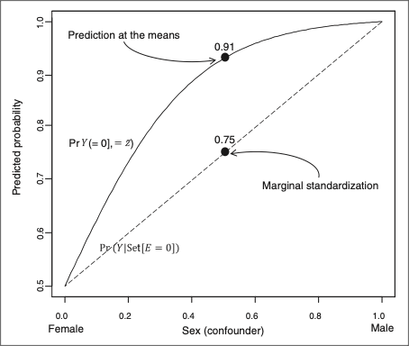
```

Figure 1. Half of a sigmoid curve depicting calculation of predicted probabilities following logistic regression using marginal standardization (dashed straight line) and prediction at the means (solid curved line) in unexposed people from a hypothetical population.


[Estimating predicted probabilities from logistic regression: different methods correspond to different target populations, by Clemma J Muller & Richard F MacLehose](https://doi.org/10.1093/ije/dyu029)


---
class: middle
### (III) Other Generalized Linear Models: 
**Log binomial:** The log-link function maps the probability of disease 

- Attempts to find a MLE if it exists. 
- Useful for RDs and RRs
- Software/packages: SAS’s GENMOD, R’s GLM or STATA’s GLM/binreg. 
- The MLE can be on the boundary of the parameter space, leading to the difficulty of finding the MLE. 

- The log-link function maps the probability of disease onto the negative real line, requiring the constraint that a linear predictor must be negative.

---
class: middle
### Log-Binomial
.pull-left[
**<span style="color:blue"> Advantages:</span>**   	
- Single uniform estimate
- Biostatisticians will love you
]
.pull-right[
**<span style="color:blue"> Disadvantages:</span>**   	 
- Very difficult to fit
- Still possible to get impossible values
]


For RDs, fit a GLM with a binomial variance and an identity link


$$g[Pr(Y=1|X=x)] = \beta_0 + \beta_1 X$$


      Wacholder S.Binomial regression in GLIM: estimating risk ratios and risk differences. 
      Am J Epidemiol 1986. Jan;123(1):174-84.62

      Spiegelman D, Hertzmark E. Easy SAS calculations for risk or prevalence ratios and differences. 
      Am J Epidemiol 2005 Aug 1;162(3):199-200. 

---
class: middle
### Logistic vs Log-Binomial

- Both model $Pr(Y|X, c)$
- Both assume that the error terms have a binomial distribution.
- Different links between the X and the Pr(Y):
  - Logistic regression, the <span style="color:blue"> _logit_ </span> function
  - Log-binomial model, the <span style="color:blue"> _log_ </span> function
- In general, the log-binomial model produces an unbiased estimate of the adjusted relative risk. 
- Minimal restriction unless adjustment for many confounders is needed. 
- The CIs for the adjusted RR may be narrower than is true


---
class: middle
## Log-Binomial

Let's estimate our RD and RR Using `glm` or `glm2` package
```{r echo=TRUE, eval=FALSE, out.width='60%'}
mod4a <- glm(switch ~ assoc + arsenic, data = wells, 
             family=binomial(link="identity"))
summ(mod4a, confint=T)
mod4b <-glm(switch ~ assoc + arsenic,  data = wells, 
            family = binomial(link = "log"))
summ(mod4b, confint=T)

```

--

**<span style="color:red"> Error! </span>**
```{r echo=FALSE, message=FALSE, warning=FALSE, out.width="80%"}
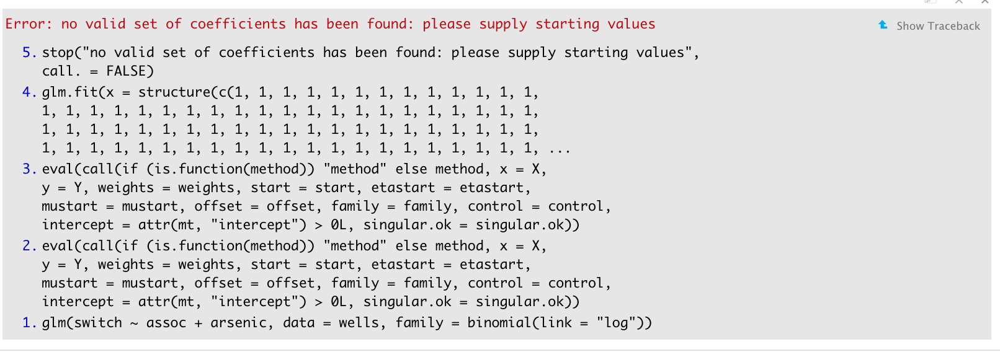
```

---

class: middle
#### To understand convergency issues we need to talk about:
**The Likelihood function**, defined (in a regression model) as the probability density of the data given the parameters and predictors.
- Maximizing the likelihood requires minimizing the sum of squared residuals; 
  - Hence the least squares estimate can be viewed as a maximum likelihood estimate under the normal model (OLS).

.pull-left[
```{r  message=FALSE, warning=FALSE, out.width='130%'}
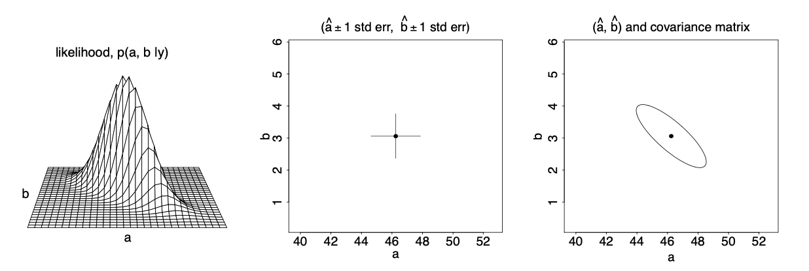
```
] 
.pull-right[
```{r  message=FALSE, warning=FALSE, out.width='80%'}
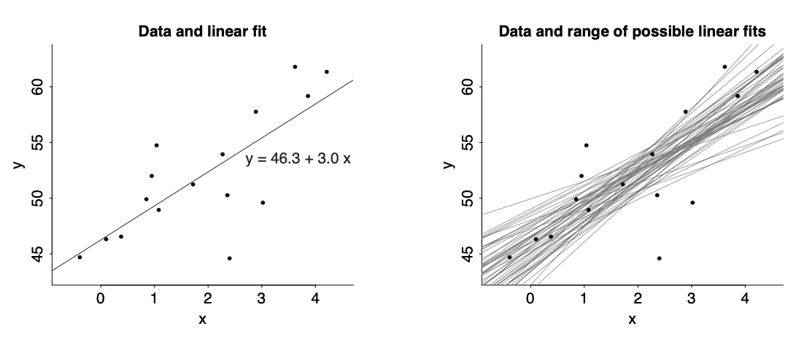
```
] 

[ROS-Gelman, Hill & Vehtari](https://users.aalto.fi/~ave/ROS.pdf)

---
class: middle
## Likelihood for GLM - Logistic Regression
For binary logistic regression with data $y_i =$  0 or 1, the likelihood is:

$$p(y|\beta, X) = \prod_{i=1}^n (logit^{-1}(X_i \beta))^{y_i} (1-logit^{-1}(X_i \beta))^{1-{y_i}}$$
To find the $\beta$ that maximizes this expression:
 - Compute the derivative of the logarithm of the likelihood.
 - Set this derivative equal to 0, and solve for $\beta$. 
 
There is **no closed-form solution**, but the maximum likelihood estimate can be found using an <span style="color:blue"> iterative optimization algorithm </span> that converges to a point of _zero_ derivative and 
  - Thus the vector of coefficients $\beta$ that maximizes the likelihood, when such a maximum exists. 


[ROS-Gelman, Hill & Vehtari](https://users.aalto.fi/~ave/ROS.pdf)

---
class: middle
### Convergency Log-Binomial
- Failed convergence occurs whenever the maximizing process fails to find the MLE. 
- Estimation challenges can be grouped based on the location of the true maximum of the log-likelihood function, relative to the parameter space. 
 - On the boundary of the parameter space (i.e., where the linear predictor equals 0); 
 - In the limit (i.e., as the linear predictor heads towards −∞); 
 - Inside the parameter space. 

These three regions span the entire parameter space and are mutually exclusive.

.pull-left[
```{r  message=FALSE, warning=FALSE, out.width='50%'}
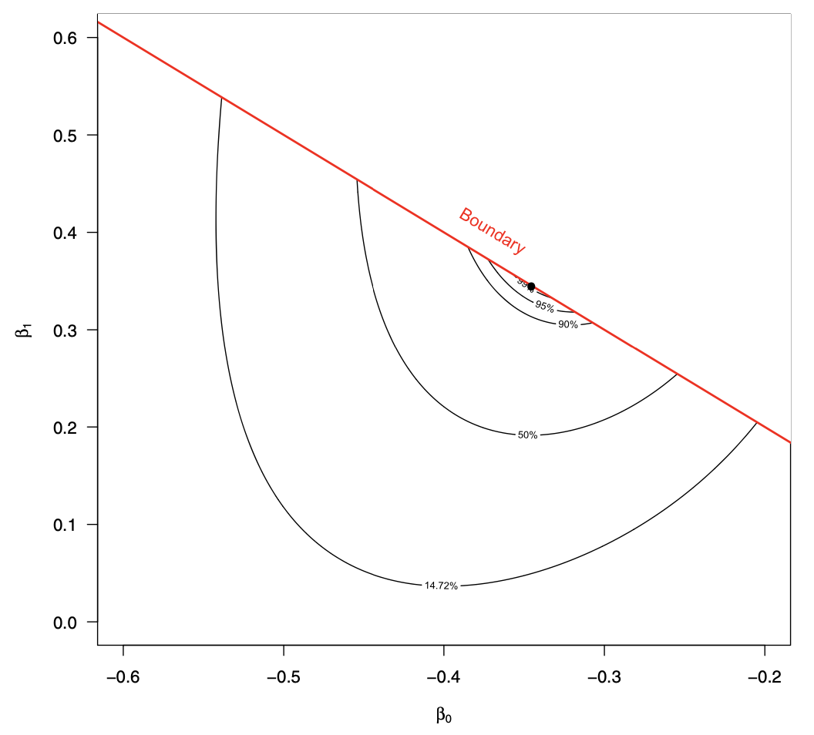
```
]
.pull-right[
```{r  message=FALSE, warning=FALSE, out.width='50%'}
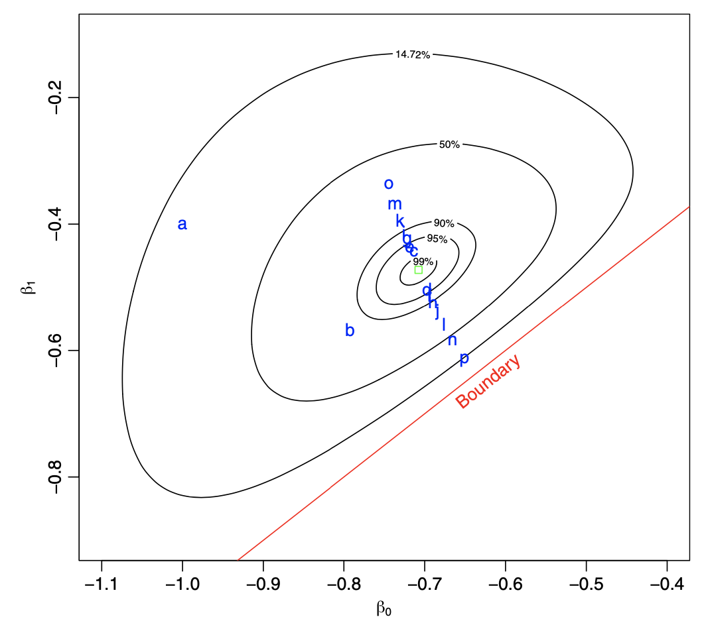
```
]

[Williamson, T.Log-binomial models: exploring failed convergence](https://doi.org/10.1186/1742-7622-10-14)

---
class: middle
### Convergency Log-Binomial

- Software utilizes iterative weighted least squares (IWLS*) approach or variations of IWLS to find MLEs for generalized linear models. 

- For log-binomial models, the weights used by the IWLS approach contain the term $1/(1-p)$, where $p = exp(X^Tβ)$ with a range from 0 to 1. 

- The MLE of a log-binomial model is likely to be too sensitive to outliers because a very large p has a large influence on the weights.

- MLE and pseudolikelihood estimators are deteriorated in presence of outliers. 

- The level of deterioration differed when the relationships between the confounder and the outcome was not in a simple form.


[Chen et al.: BMC Medical Research Methodology 2014 14:82.](https://bmcmedresmethodol.biomedcentral.com/articles/10.1186/1471-2288-14-82)

---
class: middle
###Convergence Issues
<span style="color:blue">... _Requirement that the linear predictor be constrained to be negative_</span>
... _when the issue is the boundary of the parameter space (i.e., where the linear predictor equals 0)_ the solution resides on the boundary 

```{r echo=TRUE, message=FALSE, warning=FALSE, out.width='60%'}
wells$assoc1 <- 1- wells$assoc
mod4b <-glm(switch ~ -1 + assoc1 + arsenic,  data = wells, 
            family = binomial(link = "log")) 
round(summ(mod4b, confint=T, exp=T)$"coeftable", 2)
```

<span style="color:red"> Interpretation???, setting intercept to 1; log(1) =0; Pr(Y=1) = 0.5 ??</span>

[Williamson, T. Log-binomial models: exploring failed convergence](https://doi.org/10.1186/1742-7622-10-14)

---
class: middle
###Convergence Issues
<span style="color:blue"> Requirement that the linear predictor be constrained to be negative (ii)</span>

.pull-left[
```{r echo=TRUE, message=FALSE, warning=FALSE, out.width='50%'}
library(glm2)
mod4b1 <-glm2(switch ~ assoc + arsenic, 
      data = wells, 
      family = binomial(link = "log"), 
      start = c(-1, -1,-1))
round(summ(mod4b1, confint = T, exp = T)$"coeftable", 2) 
```
]
--
.pull-right[
```{r echo=TRUE,message=FALSE, warning=FALSE,  out.width='50%'}
#
mod4b2 <-glm2(switch ~ assoc + arsenic, 
        data = wells, 
        family = binomial(link = "log"), 
        start = c(-0.5, -0.5,-0.5))
round(summ(mod4b2, confint = T, exp = T)$"coeftable", 2) 
```
]

---
class: middle
## Log-Binomial

**Using the `logbin` package**
```{r echo=TRUE, eval= F , message=FALSE, warning=FALSE,  out.width='50%'}
library(logbin)
mod4c<- logbin(switch ~ assoc + arsenic, data = wells)
round(summ(mod4c, confint = T, exp = T)$"coeftable", 2)
mod4d<- logbin(switch ~ assoc + arsenic, data = wells, trace = 1, maxit = 100000)
round(summ(mod4d, confint = T, exp = T)$"coeftable", 2)
```

```{r  message=FALSE, warning=FALSE,  out.width='70%'}
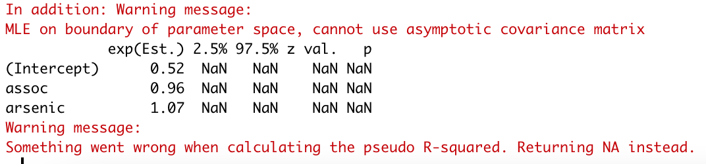
```


---
class: middle
## The **Bayesian** way 
Estimating **RD**
```{r echo=TRUE, message=FALSE, warning=FALSE,  out.width='50%'}
mod5a <- stan_glm(switch ~ assoc + arsenic, data = wells, family="gaussian", refresh=0)
round(mod5a$stan_summary[1:3,1:5-10], 3) #;print(mod5a, digits=3)
```

--
>_"In Bayesian inference, the uncertainty for each parameter in the model automatically accounts for the uncertainty in the other parameters. This property of Bayesian inference is particularly relevant for models with many predictors, and for advanced and hierarchical models."_

```{r  message=FALSE, warning=FALSE, out.width='30%'}
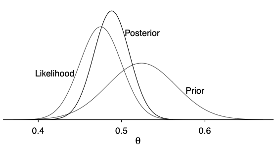
```
[ROS-Gelman, Hill & Vehtari](https://users.aalto.fi/~ave/ROS.pdf)

---
class: middle
## The **Bayesian** way 

Estimating **RR**
```{r echo=TRUE, message=FALSE, warning=FALSE}
mod5b <-stan_glm(switch ~ assoc + arsenic, data = wells, 
                 family = binomial(link = "log"), refresh=0)
round(mod5b$stan_summary[1:3,1:5-10], 3)#; print(mod5b, digits=3)
exp(mod5b$coefficients["assoc"] )
```

---
class: middle
## The **Bayesian** way 


>_If the prior distribution on the parameters is uniform, then the posterior density is proportional to the likelihood function, and the posterior mode—the vector of coefficients $𝛽$ that maximizes the posterior density is the same as the maximum likelihood estimate._

>_The benefit of Bayesian inference with a non-informative prior is that we can use simulations from the entire posterior distribution_
  - _Not just a maximum or any other point estimate—to summarize uncertainty, and we can also use these simulations to make probabilistic predictions._

[ROS-Gelman, Hill & Vehtari](https://users.aalto.fi/~ave/ROS.pdf)

---
class: middle
### Comparing results

|Model                            | Frequentist Estimates       | Bayesian Estimates        |
|:-------------------------------:|:--------------------------:|:------------------------:|
|Logit Model (Predicted probs.) $^2$ | RD= `r round(rd.i2,3)`; RR= `r round(rr.i2,3)` | RD= `r round(mean(diff1),3)`; RR= `r round(mean(ratio1), 3)` |
|AME (prediction `StdGLM`) $^2$ | RD= `r round(summary(condprob, contrast="difference", reference=0)$est.table[[2]], 3)`; RR= `r round( summary(condprob, contrast="ratio", reference=0)$est.table[[2]], 3)`|-|
|AME (`margins` at means) $^2$ | RD= `r round(mean(mar.means$dydx_assoc), 3)`  | - |
|AME (marginal standardization) $^2$ | RD= `r round( mar.RD, 3)` ; RR= `r round( mar.RR, 3)` | RD= `r round( mar.RD2, 3)` ; RR= `r round( mar.RR2, 3)` |
|GLM: Log-Binomial $^2$ | RD= ?; RR= `r round(exp(mod4b2$coefficients["assoc"]), 3)` or RRa= `r round(exp(mod4b$coefficients["assoc1"]), 3)`| RD= `r round(mod5a$coefficients["assoc"], 3)`; RR= `r round(exp(mod5b$coefficients["assoc"]), 3)`| 

 $^1$ Single predictor;  $^2$ Two predictors

---
### What about Confidence Intervals??

.pull-left[
1) **<span style="color:darkred"> Bootstrap!!!</span>**
```{r echo=TRUE, message=FALSE, warning=FALSE}
RR <- function(data,d) {
 dta <- data[d,]
 mod <- glm(switch ~ assoc + arsenic, data=dta, family = "binomial")
 pp0 <- predict(mod, newdata=transform(dta,assoc=0), type="response")
 pp1 <- predict(mod, newdata=transform(dta,assoc=1), type="response")
 return(RR=pp1/pp0)
 }

 RD <- function(data,d) {
 dta <- data[d,]
 modd <- glm(switch ~ assoc + arsenic, data=dta, family=binomial)
 pp0 <- predict(modd, newdata=transform(dta,assoc=0), type="response")
 pp1 <- predict(modd, newdata=transform(dta,assoc=1), type="response")
 return(RD=pp1-pp0)
}

library(boot)
boot.RR <- boot(data=wells, statistic=RR, R=1000)
boot.RD <- boot(data=wells, statistic=RD, R=1000)

RR <- quantile(boot.RR$t, probs=c(0.5,0.025,0.975))
RD <- quantile(boot.RD$t, probs=c(0.5,0.025,0.975))
```
]
.pull-right[
```{r echo=TRUE, message=FALSE, warning=FALSE}
RR 
RD
```

--

2) Alternatively, use prudently the `margins` or `StdReg` and other resources 

3) **<span style="color:blue">Use Bayesian Inference!!!</span>**
]
 

---
class: middle
###Conclusions: 

1) You don’t ever have to report another OR again, (unless you have a cumulative case-control study with an unknown sampling fraction)
  - The popularity of the OR was based largely on statistical convenience, but modern software has largely overcome those early limitations.  

2) The interpretation depends on the method and the assumptions required for each estimation!!!

--
```{r  message=FALSE, warning=FALSE, out.width='70%'}

```

.pull-right[<span style="color:blue"> A kind message  from Dr. Jay Kaufman!</span>]

---

class: middle

###  QUESTIONS? 

## COMMENTS?

# RECOMMENDATIONS?

---
.pull-left[
```{r echo=FALSE, message=FALSE, warning=FALSE, out.width="80%"}
include_graphics("images/L11tweet1.png")
```
]

--

.pull-right[
```{r echo=FALSE, message=FALSE, warning=FALSE, out.width="80%"}
include_graphics("images/L11tweet.png")
```
]
---

### Extra slides
Summary table of What, When and Why

| Method   | Characteristics  |  Outcome    | Measure  |
|:---------|:----------------:|:------------|:--------:|
|Standardization| Weight-based adjustment; Depends on the standard pop. selected; No homogeneity needed | Binary or categorical | SMR|
|Mantel- Haenszel Adjustment| Requires homogeneity; Do not handle clusters | Binary or categorical |RD, RR, OR|
|Regression Adjustment| Efficient, Useful for prediction, adjust for several covariates, *require assumptions* | Any type |RD, RR, OR; AME/ATE | 
|IPTW  $^1$ | Regression + Weights: 1/Pr(X=1, covars);  Ensure Exchangeability; Only for measured Confounders | Any type | **Causal** RD, RR, OR; AME/ATE |

---
class: middle
### Standardization & M-H Adjustment

- Non-parametric

- Adjustment based on weights

- Useful of a small number of covariates

- Basic arithmetic calculations

- Homogeneity assumption for M-H Adjustment

- Useful for few categorical covariate, limited for continuous variables

---
class: middle

### Regression Adjustment
- Parametric*

- Efficient (could provide measures of association for different covariates)

- Adjustment for more than one covariate at a time

- Handles different types of covariates (continuous, binary, counts, etc.)

- Control/Adjust for confounding

- Helpful for prediction

.pull-right[ <span style="color:red"> But it has a cost! </span>]


---
class: middle
##Outcome’s Distribution

|Type        | Model               | Estimate  |
|:----------:|:-------------------:|:---------:|
|Continuous|Linear Regression | RD  |
|Binary |Logistic Regression|  OR $\cong$ RR; **RD** |
|Categorical|Multinomial /Polytomous Logistic Regression|  OR ; **RD**  |
|Ordinal|Ordinal Logistic Regression|   OR; **RD**  |
|Counts|Poisson, Negative Binomial| IR, IRR  |


---
class:middle
###Graphing functions 
.pull-left[
logit maps the range (0, 1) to (−∞, ∞) useful to model binary outcomes
```{r}
d1 <- tibble(p = seq(0.001, 0.999, length.out = 1000)) %>%
  mutate(y = log(p/(1-p)))
g1 <- ggplot(d1, aes(x = p, y = y)) + 
  geom_line() + 
  xlim(0,1) + 
  ylab("logit(p)") +
  labs(title = "logit(p) vs. p")
g1
```
]

.pull-right[
Inverse logit (logistic)  maps back to the probability scale
```{r}
inv_log_graph <- function(alpha=0, beta=1){
  d2 <- data.frame(x= seq(-8,8, length.out = 1000)) %>%
    mutate(logistic = exp(alpha+beta*x)/(1+exp(alpha+beta*x))) %>%
    ggplot( aes(x = x, y = logistic)) + 
    geom_line() + 
    ylab(expression(invlogit("x"))) +
    xlab("x") +
    labs(title = "inverse logit(B1*x) versus x")
  d2
}
inv_log_graph() + labs(subtitle= "Intercept = 0, B1 = 1")
```
]
Remember invlogit  = $\dfrac{e^{\beta x}}{1+e^{\beta x}}$  how does graph change i) as coefficient of x varies? ii) with addition of intercept?     
If x = 0, invlogit  = $\dfrac{e^{0}}{1+e^{0}} = \dfrac{1}{1 + 1} = 0.5$ as shown on the graph
---
### Inverse logit graphs

```{r out.width="80%"}
library(patchwork)
fig1 <- inv_log_graph(beta=1) + labs(subtitle= "B1 = 1")
fig2 <- inv_log_graph(beta=2) + labs(subtitle= "B1 = 2")
fig3 <- inv_log_graph(beta=3) + labs(subtitle= "B1 = 3")
fig4 <- inv_log_graph(beta=-1) + labs(subtitle= "B1 = -1")
fig1 + fig2 + fig3 + fig4 +
  plot_annotation(title = 'Effect of varying B1 coefficient, intercept = 0')
```
Notice maximum slope remains at invlogit = 0.5 or x = 0     
As $\beta_{1}$ changes, slope becomes steeper ($\beta_{1}$ increases) or shallower ($\beta_{1}$ decreases) but the curve doesn't shift position.

---
### Inverse logit graphs

```{r out.width="80%"}
fig1a <- inv_log_graph(alpha=0) + labs(subtitle= "alpha=0")
fig2a <- inv_log_graph(alpha=.5) + labs(subtitle= "alpha=.5")
fig3a <- inv_log_graph(alpha=2) + labs(subtitle= "alpha=2")
fig4a <- inv_log_graph(alpha=-2) + labs(subtitle= "alpha=-2")
fig1a + fig2a + fig3a + fig4a +
  plot_annotation(title = 'Effect of varying intercept with B1 = 1')

```
Shifts the curves **horizontally** but slope remains constant and maximum remains at invlogit(x) = 0.5 or x = - intercept

---
class: middle
###R - extension of ‘margins’ and more

- Marginal effects of the adjusted estimates 
- Provides estimates for all covariates
- R-margins does not include the “over” option but is replaced by the “at=list” option

Useful resources:

[Margins](https://cran.r-project.org/web/packages/margins/vignettes/Introduction.html)

[Margins, blog](https://www.brodrigues.co/blog/2017-10-26-margins_r/)

[Estimating Risk Ratios and Risk Differences Alternatives to Odds Ratios](https://www.medschool.lsuhsc.edu/pulmonary/fellowship/docs/jama_holmberg_2020_gm_200012_1600069989.70491.pdf)

