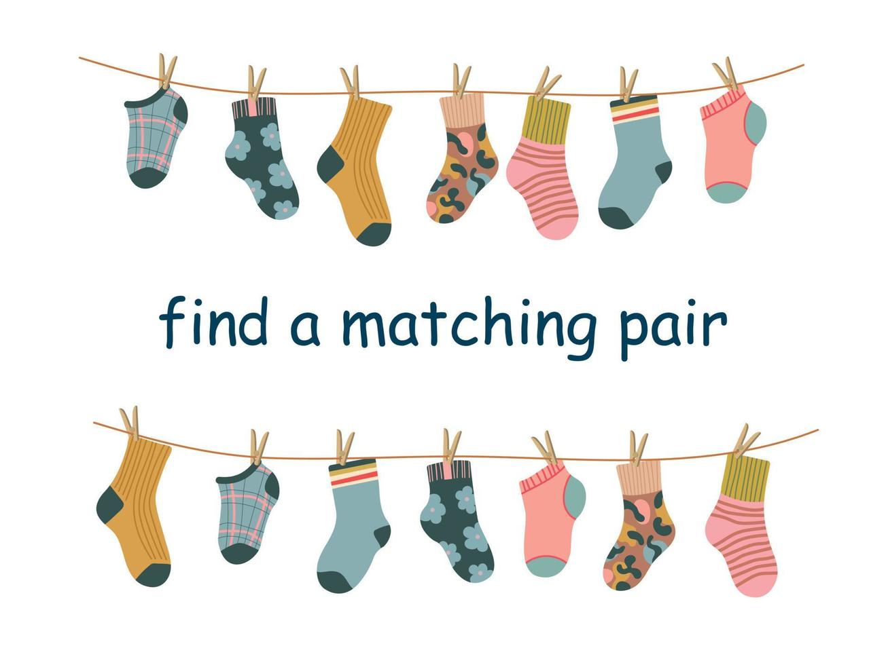
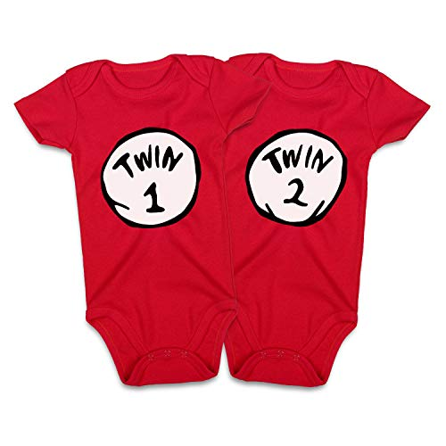
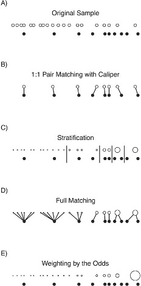
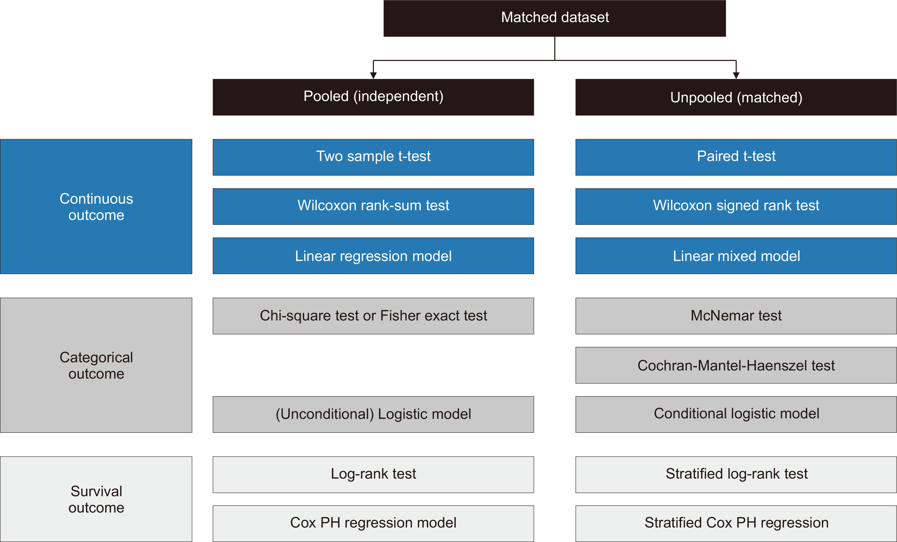
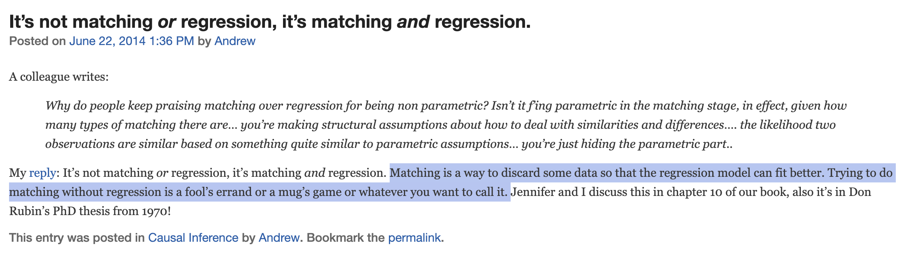
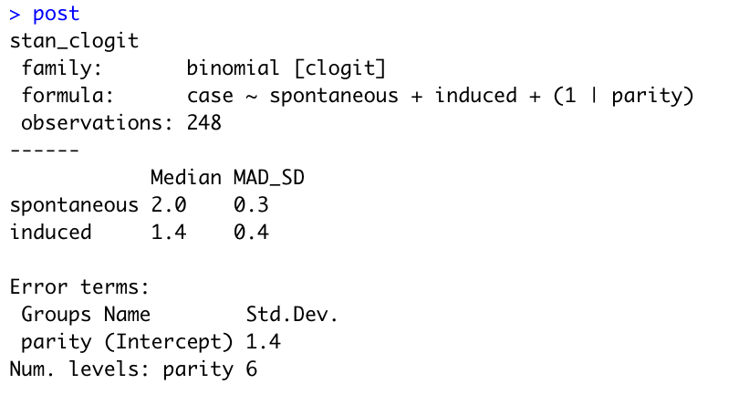
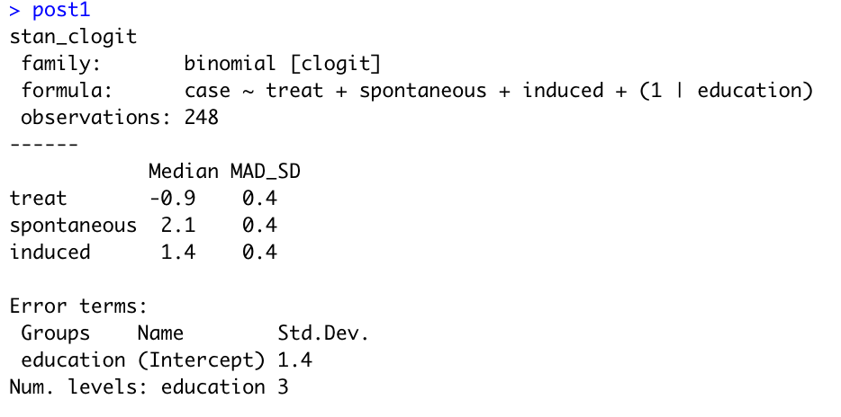
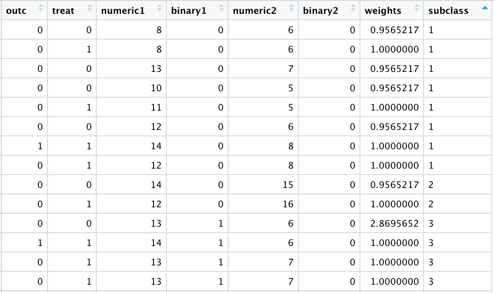

```{r setup, echo=FALSE, message = FALSE, warning = FALSE}
knitr::opts_chunk$set(
  echo = FALSE,
  eval = TRUE,
  fig.align = "center",
  fig.asp = 0.618,
  fig.retina = 3,
  fig.width = 6,
  message = FALSE,
  warning = FALSE,
  #dev = "svg",
  out.width = "80%")

options(knitr.table.format = "html")
options(knitr.kable.NA = '   ')

library(here)
library(knitr)
library(broom)
library(xaringanthemer)
library(rstanarm)
library(haven)
library(tidyverse)
library(memisc)
library(boot)
require(margins)
require(stdReg)
library(tibble)
library(broom)
library(jtools)
library(survival)
library("epiDisplay")
library(epibasix)
library("lmtest") #coeftest
library("sandwich") #vcovCL
library(MatchIt)
library("brms")
library("cmdstanr")
library(cobalt)
library(epib.704.data)
library(rstantools)
set.seed(1234)

```


```{r xaringan-themer, include = FALSE}
style_mono_accent( 
  base_color = "#881102",
  background_color = "#FFFFFF",
  code_font_size = ".8rem",
  extra_css = list("li" = list("padding" = "8px 0px 0px")))

```

class:middle
```{r echo=FALSE, message=FALSE, warning=FALSE, out.width="70%"}

```

---

class:middle
### Expected competencies
- Knows why we use "matching" in epidemiology.
- Knows advantages and disadvantages of matching

--
## Objectives
- To discuss advantages and disadvantages of matching
- To illustrate the use of logistic regression in presence of paired data
- To illustrate and discuss the use of (conditional) logistic regression for the analysis of matched/paired data

.pull-right[
+ Slides 3 - 58: Main content
+ Slides 59 - 73: Additional worked example
]

---
class:middle
## Paired Data vs Matched data

.pull-left[
```{r echo=FALSE, message=FALSE, warning=FALSE, out.width="70%"}

```
]
.pull-right[
```{r echo=FALSE, message=FALSE, warning=FALSE, out.width="70%"}

```
]


---
class:middle
## Paired data

- Expected to account for _.red["known & unknown"]_ potential confounders

- Correlated - by nature 
  - E.g., twins, same people pre-post observations, eyes in the same individual, etc.

- Variable correlation type
  -  $t_1 \neq t_0$,constant, exchangeable, lagged, etc.

---

class:middle
## Matching 

- Making comparable a set of subjects:

> _“Matching refers to the selection of a reference series – unexposed subjects in a cohort study or controls in a case-control study – that is **.blue[identical, or nearly so, to the index series]** with respect to the distribution of one or more potentially confounding factors.”_ (RGL 2008, p. 171)

--

> _"When estimating causal effects using observational data, it is desirable to replicate a randomized experiment as closely as possible by obtaining treated and control groups with similar covariate distributions. This goal can often be achieved by choosing **.rd[well-matched]** samples of the original treated and control groups, thereby reducing bias due to the covariates."_ (Stuart E, 2010) [Matching methods for causal inference: A review and a look forward](https://projecteuclid.org/journals/statistical-science/volume-25/issue-1/Matching-Methods-for-Causal-Inference--A-Review-and-a/10.1214/09-STS313.full)


---
class:middle
### Why do we match?

The main objective of matching is to make the comparison groups as similar as possible on everything **except** the variable of interest.

- <span style="color:darkred">Address confounding</span>
  - Remember **<span style="color:blue"> Exchangeability </span>** ?  
  $Pr(Y^x | X=1) = Pr(Y^x |X=0)$ or $Y^{x} \perp \!\!\! \perp {X}$ 

--

  - The related term, <span style="color:blue"> Ignorability </span>, assumes that there are no unobserved differences between the treatment and control groups, **conditional on the observed covariates**.

- Also called <span style="color:blue"> Conditional Exchangeability </span>:  $X \perp \!\!\! \perp Y^{(0)}, Y^{(1)} | Z$

---

class:middle
### Why do we match?

>"_Although causal assumptions are often invoked when using matching, **matching is simply an adjustment method** that can be used regardless of whether these assumptions are met; it is **the interpretation of the estimated effect after matching** as causal that requires these assumptions."_

[Matching Methods for Confounder Adjustment: An Addition to the Epidemiologist’s Toolbox, Epidemiologic Reviews, Volume 43, Issue 1, 2021, Pages 118–129](https://doi.org/10.1093/epirev/mxab003)

---
class:middle
## Two settings

**(1) Outcome values are not yet available:**
- Matching is used to select subjects for follow-up. 
- Relevant for high cost studies or logistics considerations preventing data collection for the full control group.
- The basis for original theoretical work and developments, comparing selecting matched versus random samples of the control group. 

--

**(2) Outcome data is already available:**
- The goal of the matching is to reduce bias in the estimation of the treatment effect.


.right[
- <span style="color:darkcyan"> Outcome values are not used in the matching process!</span>
- <span style="color:darkcyan"> The matching can be done multiple times </span>
- <span style="color:darkcyan"> Best balance –_the most similar treated and control groups_– the final matched samples. </span>
]

.small[[Matching methods for causal inference: A review and a look forward](https://projecteuclid.org/journals/statistical-science/volume-25/issue-1/Matching-Methods-for-Causal-Inference--A-Review-and-a/10.1214/09-STS313.full)]

---
class:middle
###Claimed Advantages of Matching for Causal Inference
by Liz Stuart: 
- "_1, matching methods <span style="color:darkred"> should not be seen in conflict with regression adjustment </span> and in fact the two methods are <span style="color:blue"> complementary and best used in combination.</span>_ 
--

- "_2, matching methods highlight areas of the covariate distribution where there is not sufficient overlap between the treatment and control groups, ... treatment effect estimates would <span style="color:darkred">rely heavily on extrapolation</span>._ 
  - _Selection models and regression models perform poorly when there is <span style="color:blue">insufficient overlap</span>, ... standard diagnostics do not checking this._ 
  - _Matching methods in part serve to make researchers aware of the quality of resulting inferences"._ 

- _3, matching methods have straightforward diagnostics by which their performance can be assessed"._

[Matching methods for causal inference: A review and a look forward](https://projecteuclid.org/journals/statistical-science/volume-25/issue-1/Matching-Methods-for-Causal-Inference--A-Review-and-a/10.1214/09-STS313.full)

---
class:middle
### Matching by study design
Matching is often thought about as analogous to physical control in randomized experiments

**Case Controls**: The effect of matching in a case-control study is to introduce bias into the crude association, which is accounted for only by adjusting for the matching factors in the analysis.
- If the matching factors are associated with exposure, then matching on such factors will introduce a confounding-like bias that needs to be accounted for in the analysis.
- <span style="color:blue">Conditional logistic regression is a multivariate regression approach which treats each matched pair as a separate stratum and is the analytic control of choice for the matching introduced bias</span>. 

--

**Cohort studies**: Matching exposed to unexposed subjects according to some matching factors requires no additional $^1$ analytic control for these matching factors in cohort studies.

$^1$ Debatable for some, but in principle.

---
class: middle
####<span style="color:blue">Case–control matching: effects, misconceptions, and recommendations</span>
1. Matching, even for non-confounders, can create selection bias; 
2. Matching distorts dose–response relations between matching variables and the outcome; 
3. Unbiased estimation requires accounting for the actual matching protocol as well as for any residual confounding effects;
4. For efficiency, identically matched groups should be collapsed; 
5. Matching may harm precision and power; 
6. Matched analyses may suffer from sparse-data bias, even when using basic sparse-data methods. 
<br>
--

.small[
_"Supporting advice to limit case–control matching to a few strong well- measured confounders, which would devolve to no matching if no such confounders are measured"_.

_"On the positive side, odds ratio modification by matched variables can be assessed in matched case–control studies without further data, and when one knows either the distribution of the matching factors or their relation to the outcome in the source population, one can estimate and study patterns in absolute rates."_ 

[Mansournia, M.A., Jewell, N.P. & Greenland, S. Case–control matching: effects, misconceptions, and recommendations. Eur J Epidemiol 33, 5–14 (2018).](https://doi.org/10.1007/s10654-017-0325-0)
]

---
class:middle
#### <span style="color:darkblue">If matching INDUCES confounding and/or selection bias in case-control studies, why do we do it?</span>
.pull-left[
```{r echo=FALSE, message=FALSE, warning=FALSE, out.width="40%"}

```
]
.pull-right[
```{r echo=FALSE, message=FALSE, warning=FALSE, out.width="40%"}

```
]

--

.pull-right[
#<span style="color:darkgreen"> Efficiency !! </span>
]
- By selecting only the most relevant controls, one save time and money (except if data is already collected).
- Some argue that matching provides non-parametric control (e.g., Ho et al., Political Analysis 2007)


---
class: middle
## How do we match people? 

```{r echo=FALSE, message=FALSE, warning=FALSE, out.width="60%"}

```

- Matching can involve subset selection (i.e., selecting units from the sample to retain and dropping the rest) or,
- Stratification (i.e., assigning units to pairs or strata containing both exposed and unexposed units); 
 - Some methods, like pair matching, involve both.

---
class: middle
### Matching steps

Matching methods have four key steps: #1 to #3 for “design” and #4 “analysis:”
1. Defining <span style="color:blue">“closeness”</span>: the distance measure used to determine whether an individual is a good match for another,
2. <span style="color:blue">Implementing </span> a matching method, given that measure of closeness,
3. Assessing the <span style="color:blue">quality of the resulting matched samples </span>, and perhaps iterating with
Steps (1) and (2) until well-matched samples result, and
4. <span style="color:blue">Analysis</span> of the outcome and estimation of the treatment effect, given the matching done in Step (3).

[Matching methods for causal inference: A review and a look forward](https://projecteuclid.org/journals/statistical-science/volume-25/issue-1/Matching-Methods-for-Causal-Inference--A-Review-and-a/10.1214/09-STS313.full)


---
class: middle
## 1) Closeness (i)
Two main aspects to determining the measure of distance (or “closeness”) to use in matching: 

**A) Determining which covariates to include** 
- The key concept is <span style="color:darkmagenta"> strong ignorability. </span>
- The assumption: <span style="color:darkmagenta"> no unobserved differences</span> between the treatment and control groups, conditional on the observed covariates.
- <span style="color:darkmagenta"> Include </span>  all variables  <span style="color:darkmagenta"> known </span> to be related to both treatment assignment and the outcome.
- <span style="color:darkmagenta">Should not include </span> variables that may have been  <span style="color:darkmagenta"> affected by the treatment</span> of interest (Rosenbaum, 1984; Frangakis and Rubin, 2002; Greenland, 2003). 

--

**B) Combining those covariates into one distance measure.**
- “Distance:” is a measure of the <span style="color:blue">similarity</span> between two individuals

[Matching methods for causal inference: A review and a look forward](https://projecteuclid.org/journals/statistical-science/volume-25/issue-1/Matching-Methods-for-Causal-Inference--A-Review-and-a/10.1214/09-STS313.full)

---
class: middle
## 1) Closeness (ii)
Four primary ways to define the distance $D_{ij}$ between individuals $i$ and $j$ for matching:
1. Exact: $D_{ij} = 0, \ if \ X_i=X_j ;\ D_{ij} = \infty ,\ if \ X_i \neq X_j$
2. Mahalanobis (Distance between a point and a distribution):  distance of the vector from the mean divided by the covariance matrix to account for correlation
3. Propensity score $^1$
4. Linear propensity score $^1$

--

.small[
- These measures can  be combined, e.g., exact matching on key covariates followed by propensity score matching within  groups. 
- When exact matching is not possible (e.g., sample size limitations), “fine balance” methods  may be a good alternative (Rosenbaum et al., 2007).
- Exact matches often leads to many individuals not being matched, which can result in larger bias than if the matches are inexact but more individuals remain in the analysis.
]

$^1$ We have a lecture on this!

[Matching methods for causal inference: A review and a look forward](https://projecteuclid.org/journals/statistical-science/volume-25/issue-1/Matching-Methods-for-Causal-Inference--A-Review-and-a/10.1214/09-STS313.full)


---
class: middle
#### Matching and weighting for the average exposure effect in the exposed
.pull-left[
```{r echo=FALSE, message=FALSE, warning=FALSE, out.width="50%"}

```
]
.pull-right[
_Exposed units (filled circles) and unexposed units (unfilled circles) are aligned horizontally by their propensity score. The size of the dots corresponds to the value of the resulting matching weights for the matching methods and propensity score weights for weighting by the odds._
] 

[Matching Methods for Confounder Adjustment: An Addition to the Epidemiologist’s Toolbox, Epidemiologic Reviews, Volume 43, Issue 1, 2021, Pages 118–129](https://doi.org/10.1093/epirev/mxab003)


---
class: middle
### 2) Implementing matching
- <span style="color:blue"> Type: </span> “Individually matched” or “Group matched” 
- The most commonly used design is 1:1 matched
  - Nearest neighbor matching
  - The order of matching for "treated" may change the quality of the matches

--

Selecting the <span style="color:blue"> number of matches </span> involves a bias : variance trade-off. 
- Multiple controls for each treated individual will generally increase bias since the 2nd, 3rd, and 4th closest matches are, by definition, further away from the treated individual than is the 1st closest match. 
- Multiple matches can decrease variance due to the larger matched sample size. 

<span style="color:blue"> With or without replacement:</span> controls that look similar to many treated individuals can be used multiple times and replacement can decrease bias. Also, the order in which the treated individuals are matched does not matter.
- **Recall:** Once we match on certain factors, <span style="color:red">we are forfeiting estimating their effect</span>

[Matching Methods for Confounder Adjustment](https://doi.org/10.1093/epirev/mxab003)

---
class: middle
#### <span style="color:darkblue">[Impletment matching](https://doi.org/10.1093/epirev/mxab003)</span>
|Option	           | Benefits	                         | Cautions                          |
|:----------------:|:----------------------------------|:----------------------------------|
|Matching on the covariates directly (e.g., Mahalanobis distance matching)| 	Can better balance the joint distribution of covariates; does not require an exposure model| May not perform well with many covariates, due to curse of dimensionality |
|Matching on the propensity score| 	Requires matching only on a single dimension; has theoretical balancing properties; tends to perform well empirically| 	Relies on specification of exposure model, pairs may not be close on covariates| 
|Restrictions on closeness of matches| 	Can improve balance; yields close pairs; improves robustness to assumptions about outcome model| 	Dropping units decreases precision and can change the target population/estimand| 
|Matching with replacement| 	Better balance than without replacement; good with small unexposed samples or when ratio of exposed to unexposed is high| 	Reusing units decreases precision; increases reliance on a few units |
|k:1 matching |	Retains more units, thereby increasing precision| 	Balance can be worse| 

[Matching Methods for Confounder Adjustment: An Addition to the Epidemiologist’s Toolbox, Epidemiologic Reviews, Volume 43, Issue 1, 2021, Pages 118–129](https://doi.org/10.1093/epirev/mxab003)

---
class: middle
## 3) Assess quality of the matching (i)
Covariate balance and effective sample size.

- **Balance:** The “standardized bias” or “standardized difference in means” (SDM)
  - The difference in means of each covariate, divided by the standard deviation in the full treated group. 
  - Similar to an effect size and is compared before and after matching (Rosenbaum and Rubin, 1985b). 
  - The SDM should be computed for each covariate, as well as two-way interactions and squares. 

- For regression adjustment to be <span style="color:blue"> trustworthy,</span> the absolute SDM should be <span style="color:blue"> $< 0.25$ </span> and the variance ratios should be between 0.5 and 2 (Rubin 1973, Cochran and Rubin 1973 & Rubin 2001). 

---
class: middle
#### Standardized Difference in Means (SDM)
**Data**
```{r echo=TRUE, message=FALSE, warning=FALSE}
library(stddiff); library("MatchIt") #?matchIt
set.seed(7042025); treat<- rbinom(100, 1, .45); outc<- rbinom(100, 1, .25); 
numeric1<-round(abs(rnorm(100)+1)*10,0); binary1<- rbinom(100, 1, .55); 
numeric2<-round(abs(rnorm(100)+1)*10,0); binary2<- rbinom(100, 1, .25)
data<-data.frame(outc, treat, numeric1, binary1, numeric2, binary2) #;summary(data)
```

--
**Estimation of the SDM**
```{r echo=TRUE, message=FALSE, warning=FALSE}
##the std difference using the package
stddiff.numeric(data=data, gcol=2,vcol=c(3, 5)) #;stddiff.binary(data=data, gcol=2,vcol=c(2,4,6))
##the std difference in means by hand
(mean(data$numeric1[data$treat==1])- mean(data$numeric1[data$treat==0]))/
  sd(data$numeric1[data$treat==1])
```


---
class: middle
### Assess quality of the matching (ii)
.small[ 
_Hypothesis tests and p-values that incorporate information on the sample size (e.g., t-tests) <span style="color:darkmagenta"> should not be used as measures of balance_ </span> (Austin, 2007; Imai et al., 2008). 
1. Balance is inherently an in-sample property, without reference to any broader population or super-population. 
2. NHST can be misleading as measures of balance, because they often conflate changes in balance with changes in statistical power. E.g., randomly discarding control individuals seemingly leads to increased balance, simply because of the reduced power. 
- _Hypothesis tests should not be used as part of a stopping rule to select a matched sample when those samples have varying sizes (or effective sample sizes)._ 
- _Some argue that NHST are OK for testing balance due to the reduced power for estimating the treatment effect (Hansen, 2008), but that argument requires trading off Type I and Type II errors_.  _The cost of those two types of errors may differ for balance checking and treatment effect estimation._
]

<span style="color:red"> What about the "observations are _independent_" assumption?

[Matching methods for causal inference: A review and a look forward](https://projecteuclid.org/journals/statistical-science/volume-25/issue-1/Matching-Methods-for-Causal-Inference--A-Review-and-a/10.1214/09-STS313.full)

---
class: middle
## 4) Analyze

When satisfactory matching (i.e., good covariate balance and a reasonable effective sample size) .red[is NOT achieved] after repeated specification and assessment of the quality, maybe the sample is fundamentally so different that no effect can be robustly estimated. 

--

When satisfactory matching .blue[is achieved], one can estimates the exposure effect and its uncertainty (i.e., its standard error, confidence interval, and _p-value_).
- Stratification and Regression.
- Similar to the idea of <span style="color:blue">“double robustness”</span>, and the intuition is that regression adjustment is used to “clean up” small residual covariate imbalance between the groups. 
- Matching methods should also make the treatment effect estimates less sensitive to particular outcome model specifications (Ho et al., 2007).

---
class: middle
### 4) Analyze

```{r echo=FALSE, message=FALSE, warning=FALSE, out.width="90%"}

```
.small[Lee B, Kim N, Won S, Gim J.  Propensity score matching for comparative studies: a tutorial with R and Rex.  J Minim Invasive Surg 2024;27:55-71.  https://doi.org/10.7602/jmis.2024.27.2.55]

---
class: middle
### Stratification for Matching
Assume case-control data: Consider 100 matched pairs (i.e., 100 cases and 100 controls, each paired by matching factors) 

There are 100 2x2 tables, each containing the two observations in the matched pair, which can be grouped by their combination of exposure and cases vs controls as: W, X, Y, and Z pairs.
--

.pull-left[
**W** pairs

|     |E   | -E |
|:---:|----|----|
| **D**  | 1 |0  |
| **-D** | 1 |0  |

**X** pairs

|     |E   | -E |
|:---:|----|----|
| **D** | 1 |0  |
| **-D** | 0 |1  |

]
.pull-right[
**Y** pairs

|     |E   | -E |
|:---:|----|----|
| **D** | 0 | 1 |
| **-D** | 1 |0  |

**Z** pairs

|     |E   | -E |
|:---:|----|----|
| **D** | 0 | 1 |
| **-D** | 0 |1  |
]


---

class: middle
### Stratification for Matching
The 100 2x2 tables can be summarized further as follows:

**Example:** W=30, X=30, Y=10, Z=30 $\to$ W + X + Y + Z = 100 TOTAL PAIRS

|      |      |       | **Disease Present** | 
|------|:----:|:-----:|:-----:|
|      |      |**Exposure(+)**  |**Exposure (-)** |
|**~Disease absent**|**Exposure(+)** | W = 30     | X  = 30   | 
|      |**Exposure(-)**| Y = 10    | Z   = 30   |


For all tables, from $i=1$ to 100, $N+i =2$.

--

.pull-right[
**.red[Then, how to analyze this?]**
]

---

class: middle
### Two stratified analysis options for Matching:
**1) Mantel-Haenszel Odds Ratio (ME3 2008, p. 287, eq 16-8)**

$$OR_{MH} = \left(\frac{\sum_i A_{1i} B_{0i} / N{+i}} {\sum_i A_{0i} B_{1i} / N{+i}}\right)$$ 
<br>
--
<br>

**2) McNemar Test and McNemar Odds Ratio (ME3 2008, p. 286-288)**

$X^2 = \left(\frac{(X- Y)^2}{X + Y}\right), df = 1$, with $OR_{McN} = X/Y$ 

---
class: middle

**1) Mantel-Haenszel Odds Ratio for Matching**

$$OR_{MH} = \left(\frac{\sum_i A_{1i} B_{0i} / N{+i}} {\sum_i A_{0i} B_{1i} / N{+i}}\right)$$ 

- Type W tables (case and control are exposed), $A_{1i} = B_{1i} = 1$ and $A_{0i} = B_{0i} = 0$.

- Type X tables (case is exposed, control is unexposed), $A_{1i} = B_{0i} =1$ and $A_{0i} = B_{1i} =0$ 

- Type Y tables (case is unexposed, control is exposed), $A_{1i} = B_{0i} =0$ and $A_{0i} = B_{1i} =1$ 

- Type Z tables (case and control are unexposed), $A_{1i} = B_{1i} = 0$ and $A_{0i} = B_{0i} = 1$.


---
class: middle
**1) Mantel-Haenszel Odds Ratio**
- Type W tables (case and control are exposed), $A_{1i} = B_{1i} = 1$ and $A_{0i} = B_{0i} = 0$.
- <span style="color:blue"> Type X tables (case is exposed, control is unexposed), $A_{1i} = B_{0i} =1$ and $A_{0i} = B_{1i} =0$  </span>
- <span style="color:blue"> Type Y tables (case is unexposed, control is exposed), $A_{1i} = B_{0i} =0$ and $A_{0i} = B_{1i} =1$ </span>
- Type Z tables (case and control are unexposed), $A_{1i} = B_{1i} = 0$ and $A_{0i} = B_{0i} = 1$.
<br>

--
- The Type W and Type Z tables have values of zero for all products of $A_{1i}$ and $B_{0i}$ as well as all products of $A_{0i}$ and $B_{1i}$.

- W and Z are concordant pairs, cases and controls have the same exposure level and in the $OR_{MH}$ .red[do not contribute to the OR estimation.]

---
class: middle
**1) Mantel-Haenszel Odds Ratio**

.pull-left[

$$OR_{MH} = \left(\frac{\sum_i A_{1i} B_{0i} / N{+i}} {\sum_i A_{0i} B_{1i} / N{+i}}\right)$$ 

]

.pull-right[

|      |      |       | **D** | 
|------|:----:|:-----:|:-----:|
|      |      |**E**  |**-E** |
|**~D**|**E** | W = 30     | X  = 30   | 
|      |**-E**| Y = 10    | Z   = 30   |

]

--
<br>
- Estimating $OR_{MH}= (30/2)/(10/2)$ .red[using tables X and Y Type tables], the OR estimate is 15/5 = 3.0.

- Can be obtained using `mantelhaen.test` function of the `stats` package, the `cmh.test` function of the `lawstat`,  `stratastats`, or `epi.2by2`. Input data must be either a list of 2x2 tables or a 3Dimensional array (e.g. 3 levels or 2x2x2 table).

---
class: middle
###Two stratified analysis options:

**2) McNemar Test and McNemar Odds Ratio**

Sum across all matched pair tables to form a single summary table:

.pull-left[

|      |      |       | **D** | 
|------|:----:|:-----:|:-----:|
|      |      |**E**  |**-E** |
|**~D**|**E** | W (30)    | X (30)    | 
|      |**-E**| Y (10)    | Z (30)   |


]

--

.pull-right[
$X^2 = \left(\frac{(X- Y)^2}{X + Y}\right), df = 1$

$OR_{McN} = X/Y =  30/10 = 3$ 

$SE= \sqrt{(1/X + 1/Y)}$ = $\sqrt{(1/30 + 1/10)}$ = `r round(sqrt((1/30) + (1/10)), 3)`
]

--

The McNemar $χ2$ test the null hypothesis of no association between exposure and outcome.
- Using the numbers above, $χ2= (30-10)2 / (30+10) = 400/40 = 10$. 

$OR_{McN}=$ **3** and the 95% CI is exp(`r round(log(3),3)` ± 1.96(`r round(sqrt((1/30) + (1/10)), 3)`))
= exp(`r round(log(3) - 1.96*(sqrt((1/30) + (1/10))), 3)`, `r round(log(3) + 1.96*(sqrt((1/30) + (1/10))), 3)`) = **(`r round(exp(log(3) - 1.96*(sqrt((1/30) + (1/10)))), 3)`, `r round(exp(log(3) + 1.96*(sqrt((1/30) + (1/10)))), 2)`)**

---
class: middle
**2) McNemar Test and McNemar Odds Ratio **

```{r echo=TRUE, message=FALSE, warning=FALSE, out.width='60%'}
X <- cbind(c(30,10), c(30,30));
mn_test <- mcNemar(X, alpha = 0.05)
mn_test
```

---
class: middle
**2) McNemar Test and McNemar Odds Ratio **

```{r echo=TRUE, message=FALSE, warning=FALSE}
kable(mn_test$X)
```

Can use this code to obtain details
```{r echo=TRUE, message=FALSE, warning=FALSE, eval=FALSE}
summary(mn_test)
```

---
class: middle

### .red[What to do if I have more data, other covariates to account for?]

--
<br>

### As long as you have gone through steps 1 to 3, one can move to the analysis step using Regressions...

---
class: middle
### Regression _Adjustment_ for Matching

**Straightforward way:** Fit a regression model including the matching weights in the estimation and using the coefficient on exposure as the exposure effect estimate; which is equivalent to computing a (weighted) difference in means. 
- A binary regression model with a log link can be used to estimate the risk ratio. 

--
- **_g-computation_** methods and targeted minimum loss-based estimation, can be used to ensure the resulting effect estimate is interpretable as marginal rather than conditional when the effect measure is non-collapsible. 

--
- The coefficient on exposure in stratified, conditional, and covariate-adjusted models for odds or hazard ratios corresponds to a conditional effect; thus, these models should be avoided after matching, which is best suited for estimating marginal effects.

---
class:middle


```{r echo=FALSE, message=FALSE, warning=FALSE, out.width='120%', out.height='110%'}

```


[It’s not matching or regression, it’s matching and regression.](https://statmodeling.stat.columbia.edu/2014/06/22/matching-regression-matching-regression/)

---
class: middle
**Example: Infertility after Spontaneous and Induced Abortion**: This is a matched case-control study dating from before the availability of conditional logistic regression. There are 83-strata indicated by the variable **`stratum`**.
```{r echo=TRUE, message=FALSE, warning=FALSE, out.width="50%"}
data("infert"); set.seed(7042025); infert$treat <- rbinom(length(infert$case), 1, .40) #creating a NEW variable for treatment
summary(infert[, c("case", "treat","education", "parity", "induced", 
                  "age", "spontaneous", "stratum")]); dim(infert) #?infert
```
One case with two prior spontaneous abortions and two prior induced abortions is omitted. Source: Trichopoulos et al (1976) Br. J. of Obst. and Gynaec. 83, 645–650. R-datasets packages

---
class: middle
**Assessing the dataset, closeness and quality of the matching** Example
The “standardized difference in means” (SDM) using [`stddiff`](https://rdrr.io/cran/stddiff/man/stddiff.html) package 
```{r echo=TRUE}
#(mean(infert$age[infert$treat==1])- mean(infert$age[infert$treat==0]))/
#                        sd(infert$age[infert$treat==1])
stddiff.numeric(data=infert,gcol=9,vcol=c(2,3 ))
# stddiff.category(data=infert,gcol=9,vcol=c(4,6, 1))
stddiff.binary(data=infert,gcol=9,vcol=c(4,6 )) 

```
.red[This is the step to check the balance across variables]

---
class: middle
**Implementing the matching** Example
The “standardized difference in means” (SDM) using [`matchIt`](https://cran.r-project.org/web/packages/MatchIt/vignettes/MatchIt.html ) package **Assessing the matching**
```{r echo=TRUE}
m.out<- matchit(treat ~  age+ parity + spontaneous + induced + education, 
                 data = infert, method = NULL, distance = "glm")
m.out
```

.red[This is the step to ask the software to match/check individuals treated and not treated by the given covariates]

---
class: middle

**Assessing the matching** using `matchIt` package: Example
```{r echo=TRUE}
round(summary(m.out)$"sum.all"[,1:4], 3) #summary(m.out)
```

.red[This is the step to check the balance across variables before matching. Recall in this data individuals were already matched]

---
class: middle

**Assessing the quality of the matching** using `matchIt` package: Example

**Plot of “standardized difference in means” (SDM)**
```{r echo=FALSE,  message=FALSE, warning=FALSE}
#plot(summary(m.out))
cobalt::love.plot(m.out, thresholds = c(m = .1), abs= T)+
 labs(title = 'Standardized Difference in Means', subtitle = "`infert` dataset", 
      x="Absolute Standardized\ Mean Difference", y=" ") +
  geom_vline(xintercept = 0.25, color= "blue", linetype =2)+
   theme_light() +
    theme( panel.spacing = unit(0.5, "lines"),
          strip.text.x = element_text(size = 14),
           strip.text.y = element_text(size = 16))
 
```

.red[This plot helps with the visualization of the (un)balance across variables]


---
class: middle
### Regression model for Matched Data
The model for a matched data with k = 1, ..., K strata is 
$$logit[π_k(X)] = α_k + β_1X_1 + ... + β_pX_p$$

Where $D$ is "Disease/Outcome, $π_k(X) = Pr(D_{ik} = 1|X)$, $α_k$ is log-odds in the $k_{th}$ stratum

- Unless the number of subjects in each stratum is large, fitting these models using the unconditional ML does not work well.
- In individually matched there is only one case in each stratum and hence we need some way of getting rid of the nuisance parameters.

--

**.red[Conditional likelihood:]**  the probability of the observed data conditional on the stratum total and the number of cases observed is the conditional likelihood for the _k_ the stratum. 


---
class: middle
### Considerations for Regression Adjustment with Matched Data

- Using standard logistic regression model to analyze the matched data, the effect estimates (i.e., exponentiated slope coefficients) will generally be overestimates. 

- If the data are matched 1-to-1 in pairs, the OR estimate obtained from a standard logistic model will be the square of the correct value.

--

- To complete the matched data analysis, .red[one needs a set of indicator variable that records that matched strata].

  - The coefficients for the $k - 1$ indicator variables (i.e. stratum-specific intercepts) are “nuisance parameters” in the sense that they have no epidemiologic interpretation. 
  
---
class: middle

**Standard Logistic Regression for matching:**
.red[Regression Example using the `infert` data set]
```{r echo=TRUE, message=FALSE, warning=FALSE,  out.width="70%"}
mod.logistic <- glm(case ~ treat + age + parity + education + spontaneous +induced, 
                    family = binomial(), data = infert)

```
--
.pull-left[
```{r}
cbind(Coeff= round(coef(mod.logistic), 2), round(confint(mod.logistic), 2))
```
]
--
.pull-right[
```{r}
cbind(OR= round(exp(coef(mod.logistic)), 2), round(exp(confint(mod.logistic)), 2))
```
]

.red[Although the model 'ran' and produced results, we know this model is wrong because does not account for the matched structure]
---
class: middle
**Standard Logistic Regression** .red[Example using the `infert` data set]
**Adding the stratum (n=83) variable**
```{r echo=TRUE, message=FALSE, warning=FALSE,  out.width="70%"}
mod.logistic1 <- glm(case ~ treat + age + parity+ education + spontaneous +induced + 
                       factor(stratum),#<<
                     family = binomial(), data = infert)
```

.pull-left[
```{r}
cbind(Coeff=round(coef(mod.logistic1), 2), round(confint(mod.logistic1), 2))
```
]
--

.pull-right[
```{r echo=FALSE, message=FALSE, warning=FALSE}
cbind(OR=round(exp(mod.logistic1$coefficients), 2), round(exp(confint(mod.logistic1)), 2))
```
]

---

class: middle
**Standard Logistic Regression** .red[Example using the `infert` data set] **Adding the stratum variable (n=83)**

- Then the OR formula is just the usual logistic regression formula for exposure E, confounder C, but adding in 82 indicator variables for the 83 strata of matched pairs.


--


### <span style="color:red"> This doesn't seem _Efficient_...</span>


---
class: middle
### Conditional Logistic Regression is the righ type for matched data
- We can make use of a **conditional** maximum likelihood method to estimate the exposure effect in this design, rather than the usual unconditional model. 
  - The “conditional” part refers to "conditioned on the strata of matched pairs". 
  
- The _k_ stratum-specific conditional likelihood is obtained as the probability of the observed data conditioned on the number of observations in stratum $k$ and the number of these that are cases.

- The probability of the observed data relative to the probability of the data under all other possible assignments of the $n_{1k}$ cases and $n_{0k}$ controls to $nk (= n_{1k} + n_{0k})$ subjects.


---
class: middle
### Considerations for the Conditional Logistic Regression
- This conditional likelihood is complex (see Hosmer & Lemeshow 2000, pp. 225-226)
- For 1-to-1 matching there are only 2 subjects per stratum, and the conditional likelihood for stratum k is:
$l_k (\beta) = \left(\frac{e^{\beta^{x_{1k}}}}{e^{\beta^{x_{1k}}}+ e^{\beta^{x_{0k}}}}\right)$, 

where $x_{1k}$ is the data vector for the case and $x_{0k}$ is the data vector for the control.

--
- Given values for $\beta,\ x_{1k} \ and \ x_{0k}$, the expression above is interpreted as the modeled probability that an exposed subject is a case, assuming the 1-to-1 matched design (so one of the two observations in the stratum must be a case). 
- For any stratum in which $x_{1k} = x_{0k}$ the prob. of each observation being a case is 0.5, regardless the value of $\beta$, and therefore the stratum is uninformative. 
- Checking on the frequency of the 2 types of discordant pairs, recognizing that if one or the other doesn’t occur that the conditional estimator is undefined.


---
class: middle
**Conditional Logistic Regression for matched data**, Example using the `infert` data

```{r echo=TRUE, message=FALSE, warning=FALSE,  out.width="70%"}
modelclogit <- clogit(case ~ treat + spontaneous + induced + strata(stratum), data = infert)
cbind(Coeff=round(coef(modelclogit), 2), round(confint(modelclogit), 2)) #summary(modelclogit)
```
--

.red[This shows that only contributing parameters are used in the estimation]
```{r echo=TRUE,  out.width="70%"}
clogit(case ~ treat + spontaneous + induced +
       age + parity+ education +  #<<
         strata(stratum), data = infert)
```

---
class: middle
**Conditional Logistic Regression for matched data**, Example using the `infert` data
.pull-left[
**Using Standard (Unconditional) Logistic Regression**
```{r}
cbind(OR= round(exp(coef(mod.logistic)), 2), round(exp(confint(mod.logistic)), 2))
```

]

.pull-right[
**Using Conditional Logistic Regression**
```{r}
cbind(OR=round(exp(coef(modelclogit)), 2), round(exp(confint(modelclogit)), 2))
```
<span style="color:red"> Wait, what happened to the intercept?</span>
]

--

.blue[There is no intercept estimated in this _conditional_ model because the likelihood function conditions on each matched set of _n_ observations, and a baseline average outcome cannot be estimated within each of these strata]

---
class: middle
#### Interpretations for the Conditional Logistic Regression $\beta$ coefficient?
.pull-left[
**Standard Matched Case-control**
- Estimated $β$ coefficient is the average .blue[log(odds) ]of the exposure/ variable of interest on the outcome.
- Exponentiated $β$ coefficient is the average .blue[OR] for the exposure/ variable of interest on the outcome 
]

--
.pull-left[
**Nested Case-control with Incidence Density Sampling**
- Estimated $β$ coefficient is the .red[log of the average incidence rate ratio] for the exposure/ variable of interest on the outcome.
- Exponentiated $β$ coefficient is the .red[average incidence rate ratio] for the exposure/ variable of interest on the outcome.

.red[WHY?] Here we have time-matched controls, sampled when the cases occur.
]

Recall, this is comparing exposed vs non exposed holding other variables constant [consider parameterization !!].

---
class: middle
**Matching and Conditional Logistic Regression: ** Example using the `infert` data and .red[using the `matchIt` package]. 

```{r echo=TRUE, message=FALSE, warning=FALSE, out.width="50%"}

m.out2 <- matchit(treat  ~ age+ parity + spontaneous + induced + education, 
                 data = infert, method ="cem", cutpoints = list(parity=3),
                 grouping = list( education= list(c("0-5yrs","6-11yrs"), "12+ yrs")),#<<
                 k2k = TRUE, k2k.method = "mahalanobis")#<<
```
.pull-left[
```{r echo=FALSE,  message=FALSE, warning=FALSE, out.width="50%"}
m.out2
```
]

--
<br>
.pull-right[

|Sample Sizes:|        |        |
|:------------|:------:|:------:|
|             | Control| Treated|
|All           | 99   |     149|
|Matched       | 52   |     52|
|Unmatched     |  47    |    97|
|Discarded      |  0    |     0|
]

.red[For illustration ONLY, here we changed the matching structure but the dataset was already matched]

---
class: middle
**Matching and Conditional Logistic Regression: ** Example using the `infert` data and the `matchIt` package to plot of balance 

```{r echo=FALSE, message=FALSE, warning=FALSE}
#plot(summary(m.out2))
 cobalt::love.plot(m.out2, thresholds = c(m = .1), abs= T)+
 labs(title = 'Standardized Difference in Means', subtitle = "`infert` dataset", 
      x="Absolute Standardized\ Mean Difference", y=" ") +
  geom_vline(xintercept = 0.25, color= "blue", linetype = 2)+
   theme_light() +
    theme( panel.spacing = unit(0.5, "lines"),
          strip.text.x = element_text(size = 14),
           strip.text.y = element_text(size = 16))
```

.red[This plot illustrates the balance before (unadjusted) and after (adjusted) matching]

---
class: middle
**Matching and Conditional Logistic Regression: ** Example using the `infert` data and the `matchIt` package to provide a **Summary of Balance Before-Matching**
```{r echo=FALSE, out.width="30%", message=FALSE, warning=FALSE}
round(summary(m.out2)$"sum.all"[,1:4], 3)
```
--
**.red[Summary of Balance After-Matching]**
```{r echo=FALSE, out.width="30%", message=FALSE, warning=FALSE}
round(summary(m.out2)$"sum.matched"[,1:4], 3)
```

---
class: middle
**Matching and Conditional Logistic Regression: ** Example using the `infert` data and the `matchIt` package
.pull-left[
**With weights**
```{r echo=TRUE,  out.width="40%", message=FALSE, warning=FALSE}
match.data1 <- match.data(m.out2) #<<
#;head(match.data1)
mod.logistic2 <- glm(case ~ treat + age + parity+ education + spontaneous +induced, 
                     family = binomial(), 
                     data = match.data1, weights = weights) #<<
#summary(mod.logistic2); coeftest(mod.logistic2, vcov. = vcovCL, cluster = ~subclass, digits=2) #robust variance
cbind(Coeff= round(coefficients(mod.logistic2), 2), round(confint(mod.logistic2),2))
```
]

--

.pull-right[
**Without weights**
```{r, message=FALSE, warning=FALSE, echo=T}
mod.logistic2a <- glm(case ~ treat + age + parity+ education + spontaneous+induced, family = binomial(), 
                     data = match.data1) #<<
cbind(round(coefficients(mod.logistic2a), 2), round(confint(mod.logistic2a),2))
```

```{r, message=FALSE, warning=FALSE, echo=TRUE}
summary(match.data1$weights)
```
]

.red[Coefficients are identical because all have same weight=1]
---
class: middle 
**Using `clogit` function**
```{r message=FALSE, warning=FALSE, echo=TRUE}
mod.clog3 <- clogit(case ~ treat + age + parity+ education + spontaneous + induced,
                     data = match.data1)#<<
cbind(Coeff=round(coefficients(mod.clog3), 2), round(confint(mod.clog3),2))
```

--

**GLM using weights and the `strata` **
```{r message=FALSE, warning=FALSE, echo=TRUE}
cbind(Coeff=round(coefficients(mod.logistic2), 2), round(confint(mod.logistic2),2))
```


---
class: middle  
### What is the quantity estimated in presence of Matching?
- The estimand matching is most often used for is the average exposure effect among those who were exposed, also known as the average treatment effect on the treated **.red[(ATT)]**,   
   - I.e., the average difference between the observed outcomes for those exposed and their counterfactual outcomes had they not been exposed. 
   - This is the same quantity estimated using weighting by the odds (if such). 
--
<br>

- Some matching methods allow estimation of the average exposure effect in the population, e.g., estimated with inverse probability weights. $^1$ 
   - The choice of estimand depends on the desired target population of interest, which should be specified before the analysis, and matching methods appropriate for that estimand should be used.

$^1$ More on this on the propensity score lecture!


---
class: middle
### The Bayesian way???
```{r echo= T, eval=FALSE, message=FALSE, warning=FALSE, cache=TRUE}

infert1 <- infert[order(infert$stratum), ]
post <- stan_clogit(case ~ spontaneous + induced + (1 | parity), strata = stratum,
                  data = infert1, # order necessary subset = parity <= 2,
                     QR = TRUE, cores = 2, seed = 7042025)
post
PPD <- posterior_predict(post) #; summary(PPD)
post1 <- stan_clogit(case ~  treat + spontaneous + induced + (1 |education),
                    data = infert[order(infert$stratum), ], strata = stratum, 
                    QR = TRUE, cores = 4, seed = 7042025)
post1
```

.pull-left[
```{r, out.width='110%'}

```
]
.pull-right[
```{r message=FALSE, warning=FALSE, out.width='110%'}

```
]

[Conditional logistic (clogit) regression models via Stan](http://mc-stan.org/rstanarm/reference/stan_clogit.html)

---
class: middle
### Interpretation: Frequentist vs Bayesian

- The Bayesian approach provides a **complete posterior** distribution of the log (average Odss or IRR) 

- The frequentist approach provides a fixed parameter estimate of the log (average Odds or IRR) and an estimate of its sampling variance.  

---
class: middle

###  QUESTIONS? 

## COMMENTS?

# RECOMMENDATIONS?

---
class: middle
### Details of the McNemar Test

```{r echo=TRUE, message=FALSE, warning=FALSE}
summary(mn_test)
```

---
class: middle

**Code for the Plot of “standardized difference in means” (SDM)**
```{r echo=T,  message=FALSE, warning=FALSE, eval=T}
#plot(summary(m.out)) #this provides a series of Q-Q plots
cobalt::love.plot(m.out, thresholds = c(m = .1), abs= T)+ #this provide the line at 0.1
 labs(title = 'Standardized Difference in Means', subtitle = "`infert` dataset", 
      x="Absolute Standardized\ Mean Difference", y=" ") +
  geom_vline(xintercept = 0.25, color= "blue", linetype =2)+ #this provide the line at 0.25
   theme_light() +
    theme( panel.spacing = unit(0.5, "lines"),
          strip.text.x = element_text(size = 14),
           strip.text.y = element_text(size = 16))
 
```

---
class: middle

##Additonal worked example

---
class: middle
## Matching and Conditional Logistic Regression
Using the `simualted` example and the `matchIt` package.

```{r echo=TRUE}
m.out.sim <- matchit(treat ~ numeric1 + binary1 + numeric2 + binary2,  
                     data = data,  method = NULL, distance = "glm")#<<
m.out.sim
```
--
```{r}
summary(m.out.sim)
#plot(m.out.sim, type = "jitter", interactive = FALSE)
```

---
class: middle
## Matching and Conditional Logistic Regression
Using the `simualted` example
```{r echo=TRUE,  out.width="40%", message=FALSE, warning=FALSE}
m.out.sim1 <- matchit(treat ~ numeric1 + binary1 + numeric2 + binary2,  data = data, 
                 distance = "mahalanobis", replace = TRUE)#<<
m.out.sim1
```

---
class: middle
## Matching and Conditional Logistic Regression
Using the `simualted` example, Plot of balance `simualted` Example
```{r echo=FALSE, message=FALSE, warning=FALSE}
#plot(summary(m.out.sim1))
  cobalt::love.plot(m.out.sim1, thresholds = c(m = .1), abs= T)+
 labs(title = 'Standardized Difference in Means', subtitle = "`infert` dataset", 
      x="Absolute Standardized\ Mean Difference", y=" ") +
  geom_vline(xintercept = 0.25, color= "blue", linetype = 2)+
    theme_light() +
    theme( panel.spacing = unit(0.5, "lines"),
          strip.text.x = element_text(size = 14),
           strip.text.y = element_text(size = 16))
 
```


---
class: middle
## Matching and Conditional Logistic Regression
**Summary of Balance for All Data (Pre-Matching)** Using the `simualted` example
```{r out.width="50%" , message=FALSE, warning=FALSE}
summary(m.out.sim1)
```

---
class: middle
## Matching and Conditional Logistic Regression
**Summary of Balance for Matched Data** Using the `simualted` example
```{r out.width="50%" , message=FALSE, warning=FALSE}
summary(m.out.sim1, un=F)
```


---
class: middle
#### Matching and Conditional Logistic Regression 
Using the `simualted` example
.pull-left[
**Estimation without weights**
```{r echo=TRUE, message=FALSE, warning=FALSE, out.width="50%"}
sim.match.data1 <- match.data(m.out.sim1) #<<
mod.sim1 <- glm(outc ~ treat + numeric1 + binary1 + numeric2 + binary2, 
                     family = binomial(), data = sim.match.data1)
#summary(mod.sim1)
cbind(Coeff=round(mod.sim1$coefficients, 2), round(confint(mod.sim1), 2))

summary(sim.match.data1 $weights)
```
]
.pull-right[
**Estimation using matching weights**
```{r echo=TRUE, message=FALSE, warning=FALSE, out.width="50%"}
mod.sim2 <- glm(outc ~ treat + numeric1 + binary1 + numeric2 + binary2, 
                     family = binomial(), data = sim.match.data1, weights = weights) #<<
#summary(mod.sim2)
round(coeftest(mod.sim2, vcov. = vcovCL), 2)
```
]


---
class: middle
#### Matching and Conditional Logistic Regression 

**Estimation using Conditional Logistic Regression**

`clogit` Regression using the `simualted` example

.pull-left[
```{r echo=TRUE, message=FALSE, warning=FALSE, out.width="50%"}
modelclogit2 <- clogit(outc ~ treat + numeric1 + binary1 + numeric2 + binary2, 
                       weights = weights, data = sim.match.data1) #<<
cbind(Coeff= round(coef(modelclogit2), 2), round(confint(modelclogit2), 2))
```
]
.pull-right[

|Sample Sizes:|        |        |
|:------------|:------:|:------:|
|             | Control| Treated|
|All           |  55.   |     45|
|Matched (ESS) |  18.58  |    45|
|Matched       |  28.   |     45|
|Unmatched     |  27.    |     0|
|Discarded      |  0.    |     0|

]

---
class: middle
#### Matching and Conditional Logistic Regression 
Modification of the matching using the `simualted` example
```{r echo=TRUE, message=FALSE, warning=FALSE, out.width="50%"}

m.out.sim2<- matchit(treat ~ numeric1 + binary1 + numeric2 + binary2, data = data,
                  method = "cem", cutpoints = list(numeric1 = 5), #<<
                  grouping = list(binary1 = list(c(0, 1)) ))
summary(m.out.sim2, un=F)
```

---
class: middle
#### Matching and Conditional Logistic Regression 
Modification of the matching using the `simualted` example
```{r echo=TRUE, message=FALSE, warning=FALSE, out.width="50%"}
match.data2 <- match.data(m.out.sim2)
```
.pull-left[
```{r, message=FALSE, warning=FALSE, out.width="50%"}
head(match.data2)
summary(match.data2$weights)
summary(match.data2$subclass)
```
]

--

.pull-right[
```{r  message=FALSE, warning=FALSE, out.width="90%"}

```
]

---
class: middle
### The Bayesian Way  
```{r eval=FALSE, echo=TRUE}

dat2 <- match.data2[order(match.data2$subclass), ] # order by strata
post3 <- stan_clogit(outc ~  treat +   numeric1 +  numeric2 +binary1+ (1 | binary2), #
                    strata = subclass,
                    data = dat2,
                    chains = 2, iter = 100)
post3
post4 <- stan_clogit(outc ~  treat +  numeric1 +  numeric2 + binary1+ (1 | binary2),
                    data = dat2[order(dat2$subclass), ], # order necessary
                    strata = subclass, QR = TRUE,
                    cores = 2, seed = 704)

post4

```
                                                                                      
                                                                                      
---
class: middle
### Regression equation
Consider the 1:1 matched design (simplest case) with $k = 1$, ..., _K_ strata and _p_ covariates
$logit(π_k(X))=α_k +β′X$


Where $π_k(X) = Pr(D_{ik} = 1|X)$, $α_k$ is log-odds in the $k_{th}$ stratum; $X_{0k}$ be the data vector for the control and $X_{1k}$ be the data vector for the case. $S_k = D_{0k} + D_{1k}$ .


$$L_k(β) = Pr(D_{1k} = 1, D_{0k} = 0|X_{1k}, X_{0k}, S_k = 1, n_k = 2)$$
                              


